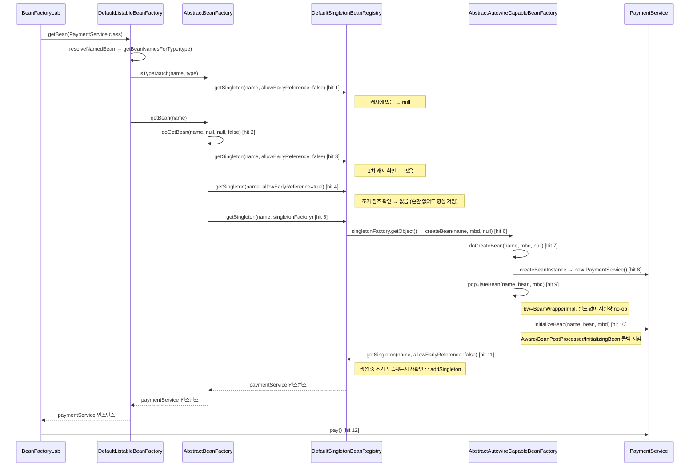

# getBean(Class) 시퀀스 — BeanFactoryLab

[`bean-factory-getbean.md`](../bean-factory-getbean.md)의 6번(호출 흐름) 항목을 시각화한 것. `tools/jdi-tracer`로 관찰한 실제 브레이크포인트 히트 순서(hit #1~#12)를 그대로 반영했다.

```mermaid
sequenceDiagram
    participant Main as BeanFactoryLab#main
    participant DLBF as DefaultListableBeanFactory
    participant ABF as AbstractBeanFactory
    participant DSBR as DefaultSingletonBeanRegistry
    participant AACBF as AbstractAutowireCapableBeanFactory
    participant PS as PaymentService

    Main->>DLBF: getBean(PaymentService.class)
    DLBF->>DLBF: resolveNamedBean → getBeanNamesForType(type)
    DLBF->>ABF: isTypeMatch(name, type)
    ABF->>DSBR: getSingleton(name, allowEarlyReference=false)  [hit 1]
    Note right of DSBR: 캐시에 없음 → null

    DLBF->>ABF: getBean(name)
    ABF->>ABF: doGetBean(name, null, null, false)  [hit 2]
    ABF->>DSBR: getSingleton(name, allowEarlyReference=false)  [hit 3]
    Note right of DSBR: 1차 캐시 확인 → 없음
    ABF->>DSBR: getSingleton(name, allowEarlyReference=true)  [hit 4]
    Note right of DSBR: 조기 참조 확인 → 없음 (순환 없어도 항상 거침)

    ABF->>DSBR: getSingleton(name, singletonFactory)  [hit 5]
    DSBR->>AACBF: singletonFactory.getObject() → createBean(name, mbd, null)  [hit 6]
    AACBF->>AACBF: doCreateBean(name, mbd, null)  [hit 7]
    AACBF->>PS: createBeanInstance → new PaymentService()  [hit 8]
    AACBF->>AACBF: populateBean(name, bean, mbd)  [hit 9]
    Note right of AACBF: bw=BeanWrapperImpl, 필드 없어 사실상 no-op
    AACBF->>PS: initializeBean(name, bean, mbd)  [hit 10]
    Note right of AACBF: Aware/BeanPostProcessor/InitializingBean 콜백 지점

    AACBF->>DSBR: getSingleton(name, allowEarlyReference=false)  [hit 11]
    Note right of DSBR: 생성 중 조기 노출됐는지 재확인 후 addSingleton

    DSBR-->>ABF: paymentService 인스턴스
    ABF-->>DLBF: paymentService 인스턴스
    DLBF-->>Main: paymentService 인스턴스
    Main->>PS: pay()  [hit 12]
```
