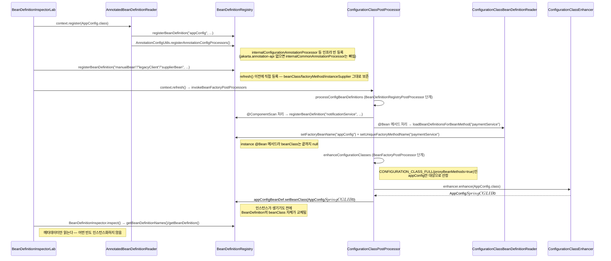

# AppConfig의 BeanDefinition이 refresh() 동안 바뀌는 흐름

[`bean-definition-registration.md`](../bean-definition-registration.md)의 6번(호출 흐름) 항목을 시각화한 것. `experiments/bean-definition-inspector`의 `BeanDefinitionInspectorLab`이 실제로 거치는 경로다.

