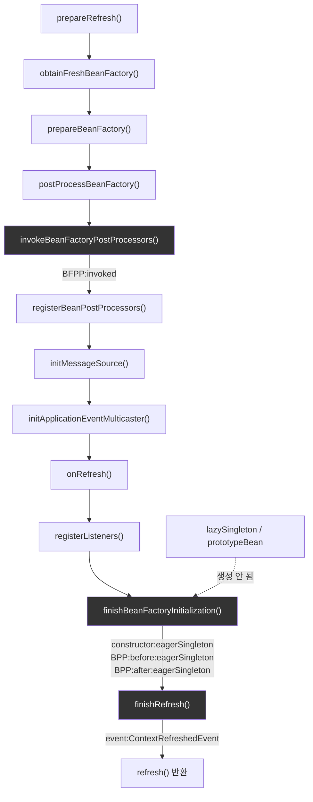

# refresh()의 12단계와 우리가 관찰한 이벤트의 대응

[`context-refresh.md`](../context-refresh.md)의 6번(호출 흐름) 항목을 시각화한 것. 왼쪽은 `AbstractApplicationContext#refresh()`의 공식 단계, 오른쪽은 `RefreshEventLog`가 실제로 기록한 이벤트다.

`finishBeanFactoryInitialization()`이 non-lazy singleton을 전부 만들고 나서야 `finishRefresh()`가 `ContextRefreshedEvent`를 발행한다 — 그래서 리스너가 이벤트를 받는 시점에는 이미 모든 eager singleton이 완성돼 있다.
