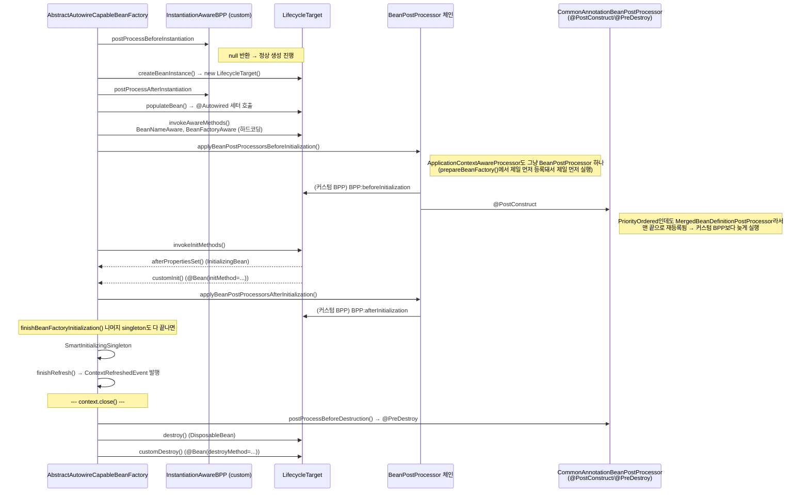

# LifecycleTarget 하나가 거치는 전체 생명주기

[`bean-lifecycle.md`](../bean-lifecycle.md)의 6번(호출 흐름) 항목을 시각화한 것. `experiments/bean-lifecycle-recorder`에서 실제로 관찰한 순서를 그대로 반영했다.

```mermaid
sequenceDiagram
    participant ACBF as AbstractAutowireCapableBeanFactory
    participant IABPP as InstantiationAwareBPP (custom)
    participant Target as LifecycleTarget
    participant BPPs as BeanPostProcessor 체인
    participant CommonBPP as CommonAnnotationBeanPostProcessor<br/>(@PostConstruct/@PreDestroy)

    ACBF->>IABPP: postProcessBeforeInstantiation
    Note right of IABPP: null 반환 → 정상 생성 진행
    ACBF->>Target: createBeanInstance() → new LifecycleTarget()
    ACBF->>IABPP: postProcessAfterInstantiation
    ACBF->>Target: populateBean() → @Autowired 세터 호출

    ACBF->>Target: invokeAwareMethods()<br/>BeanNameAware, BeanFactoryAware (하드코딩)
    ACBF->>BPPs: applyBeanPostProcessorsBeforeInitialization()
    Note right of BPPs: ApplicationContextAwareProcessor도 그냥 BeanPostProcessor 하나<br/>(prepareBeanFactory()에서 제일 먼저 등록돼서 제일 먼저 실행)
    BPPs->>Target: (커스텀 BPP) BPP:beforeInitialization
    BPPs->>CommonBPP: @PostConstruct
    Note right of CommonBPP: PriorityOrdered인데도 MergedBeanDefinitionPostProcessor라서<br/>맨 끝으로 재등록됨 → 커스텀 BPP보다 늦게 실행

    ACBF->>Target: invokeInitMethods()
    Target-->>ACBF: afterPropertiesSet() (InitializingBean)
    Target-->>ACBF: customInit() (@Bean(initMethod=...))

    ACBF->>BPPs: applyBeanPostProcessorsAfterInitialization()
    BPPs->>Target: (커스텀 BPP) BPP:afterInitialization

    Note over ACBF: finishBeanFactoryInitialization() 나머지 singleton도 다 끝나면
    ACBF->>ACBF: SmartInitializingSingleton#afterSingletonsInstantiated()
    ACBF->>ACBF: finishRefresh() → ContextRefreshedEvent 발행

    Note over ACBF: --- context.close() ---
    ACBF->>CommonBPP: postProcessBeforeDestruction() → @PreDestroy
    ACBF->>Target: destroy() (DisposableBean)
    ACBF->>Target: customDestroy() (@Bean(destroyMethod=...))
```
