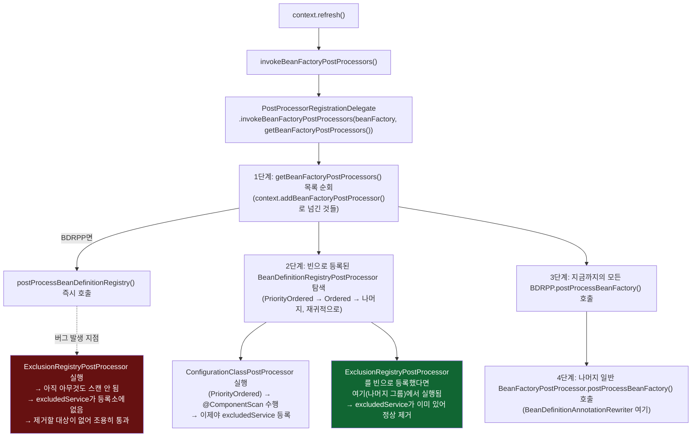

# addBeanFactoryPostProcessor()로 등록한 BDRPP가 스캔보다 먼저 실행되는 이유

[`beanfactory-postprocessor.md`](../beanfactory-postprocessor.md)의 6번(호출 흐름)·8번(런타임 관찰) 항목을 시각화한 것 — 처음 겪었던 버그(제거가 조용히 안 먹힌 것)의 원인을 그대로 그렸다.

수정 전(왼쪽 경로, `addBeanFactoryPostProcessor`)과 수정 후(오른쪽 경로, `registerBean`)의 차이는 딱 하나 — **어느 단계에서 발견되느냐**다. 코드 자체는 똑같다.
