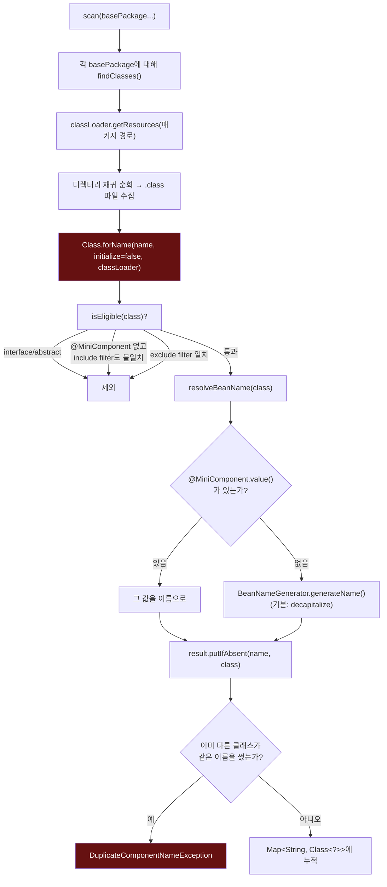

# ComponentScanner.scan()의 내부 파이프라인

[`component-scan.md`](../component-scan.md)의 6번(호출 흐름) 항목을 시각화한 것.

`E`(빨간 상자)가 실제 Spring과 가장 크게 갈라지는 지점이다 — 우리는 클래스를 **로딩**하고, Spring의 `MetadataReader`는 바이트코드만 **읽는다** (11번 참고).
