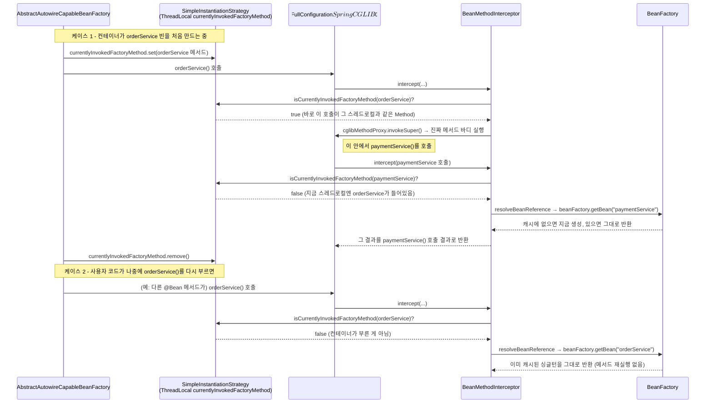

# orderService() 안에서 paymentService()를 호출하면 실제로 무슨 일이 일어나는가

[`configuration-bean.md`](../configuration-bean.md)의 6번(호출 흐름) 항목을 시각화한 것. `experiments/configuration-proxy-lab`의 `FullConfiguration`을 기준으로, `BeanMethodInterceptor.intercept()`가 두 가지 경우를 어떻게 다르게 처리하는지 그렸다.

핵심은 `ThreadLocal<Method> currentlyInvokedFactoryMethod` 하나로 "지금 이 호출이 컨테이너 자신이 빈을 만들려고 부른 것인가, 아니면 누군가(사용자 코드 포함) 크로스 레퍼런스로 부른 것인가"를 구분한다는 것이다.
