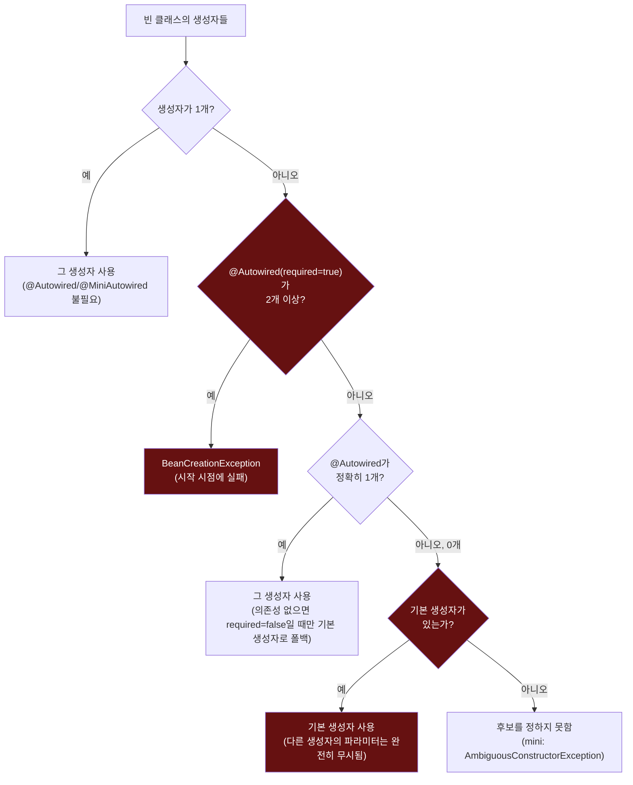
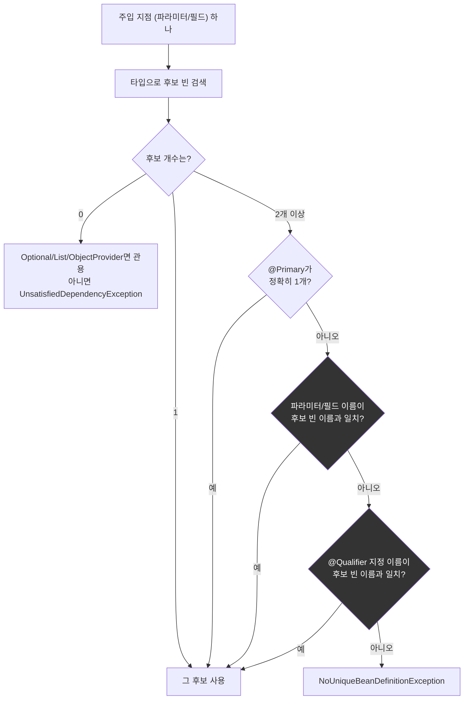

# 생성자 선택과 후보 선택, 두 개의 결정 트리

[`dependency-resolution.md`](../dependency-resolution.md)의 6번(호출 흐름) 항목을 시각화한 것. 왼쪽은 "어떤 생성자를 쓸 것인가", 오른쪽은 "그 생성자의 파라미터 하나를 무엇으로 채울 것인가"라는, 서로 다른 두 단계의 결정이다.

두 번째 트리에서 "이름 일치"(G)가 "`@Qualifier`"(H)보다 먼저 검사된다는 순서는 `DefaultListableBeanFactory#determineAutowireCandidate` 소스를 직접 읽고서야 확인했다(9번 참고) — 실무에서 거의 부딪히지 않는 순서지만, 파라미터 이름이 우연히 다른 빈 이름과 겹치면 `@Qualifier`보다 먼저 이 규칙이 이긴다.
