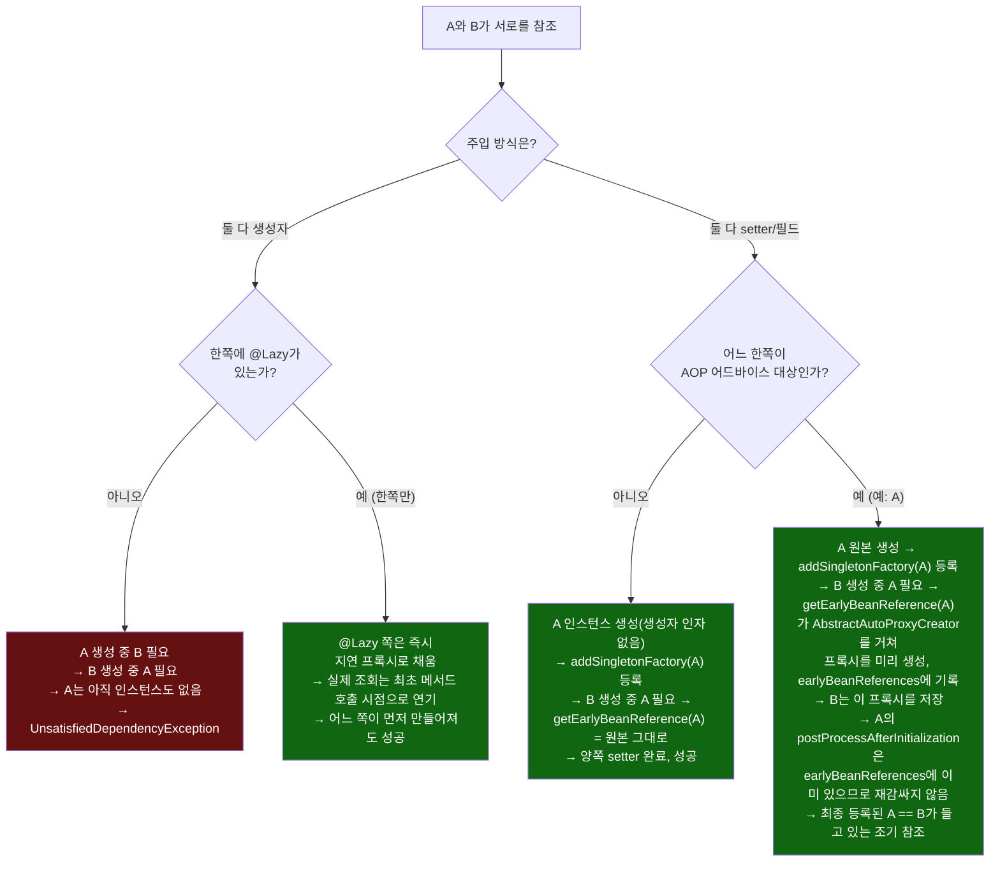
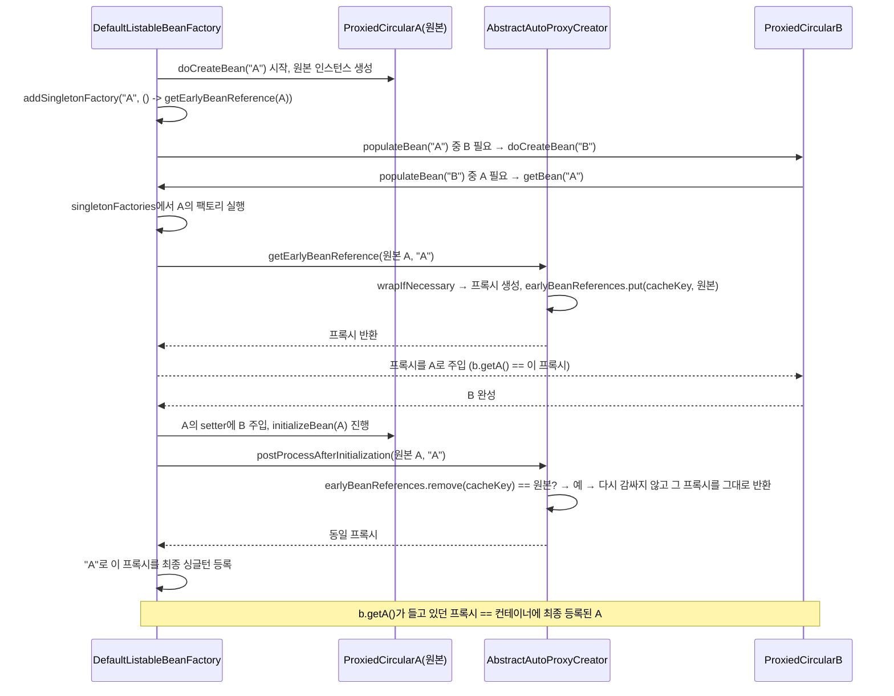

# 순환 참조 네 가지 경로

[`primary-qualifier-circular.md`](../primary-qualifier-circular.md)의 6번(호출 흐름) 항목을 시각화한 것. 같은 "A와 B가 서로를 참조"하는 상황이 주입 방식(생성자/setter)과 부가 요소(`@Lazy`, AOP 프록시)에 따라 완전히 다른 결과로 갈리는 지점을 보여준다.

