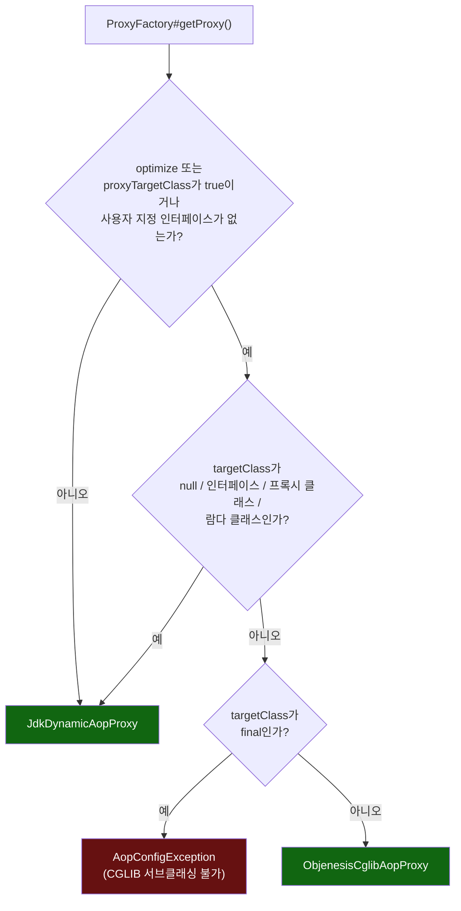

# 프록시 종류 선택과 인터셉터 체인 진행

[`proxy-interceptor.md`](../proxy-interceptor.md)의 6번(호출 흐름) 항목을 시각화한 것. 왼쪽은 "이 빈에 어떤 종류의 프록시를 씌울 것인가"라는 1회성 결정, 오른쪽은 "프록시된 메서드 호출 한 번이 인터셉터 체인을 어떻게 통과하는가"라는 매 호출마다 반복되는 결정이다.



```mermaid
sequenceDiagram
    participant Caller as 외부 호출자
    participant Proxy as 프록시(JDK/CGLIB)
    participant Inv as ReflectiveMethodInvocation
    participant I1 as LoggingInterceptor
    participant I2 as AuthorizationInterceptor
    participant I3 as TimingInterceptor
    participant Target as 실제 대상 객체

    Caller->>Proxy: proxy.greet("A")
    Proxy->>Inv: new ReflectiveMethodInvocation(target, method, args, [I1,I2,I3])
    Proxy->>Inv: proceed()
    Inv->>I1: invoke(this)  (index: -1 → 0)
    I1->>Inv: proceed()
    Inv->>I2: invoke(this)  (index: 0 → 1)
    I2->>Inv: proceed()
    Inv->>I3: invoke(this)  (index: 1 → 2)
    I3->>Inv: proceed()
    Inv->>Target: method.invoke(target, args)  (index == size - 1)
    Target-->>Inv: 반환값
    Inv-->>I3: 반환값
    I3-->>I2: 반환값
    I2-->>I1: 반환값
    I1-->>Proxy: 반환값
    Proxy-->>Caller: 반환값

    Note over Target,Caller: self-invocation이라면 Target 내부에서 다른 메서드를<br/>this로 직접 호출 - Proxy/Inv를 거치지 않으므로<br/>I1/I2/I3 중 아무것도 다시 실행되지 않는다
