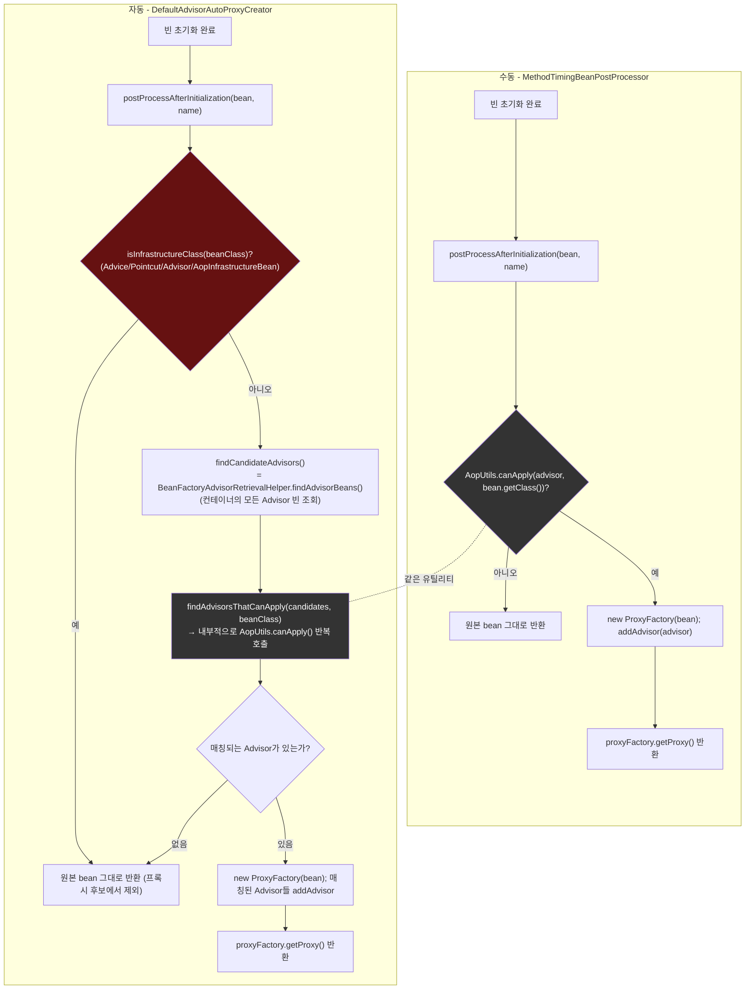

# 수동 BeanPostProcessor와 자동 프록시 생성기, 같은 판정 로직을 부르는 두 경로

[`auto-proxy-creator.md`](../auto-proxy-creator.md)의 6번(호출 흐름) 항목을 시각화한 것. 두 구현 모두 결국 `AopUtils.canApply()`(mini는 그에 대응하는 `hasEligibleMethod()`)와 `ProxyFactory`(mini는 `MiniProxyFactory`)로 수렴한다 — 차이는 "누가, 어느 시점에 그 판정을 호출하는가"뿐이다.

