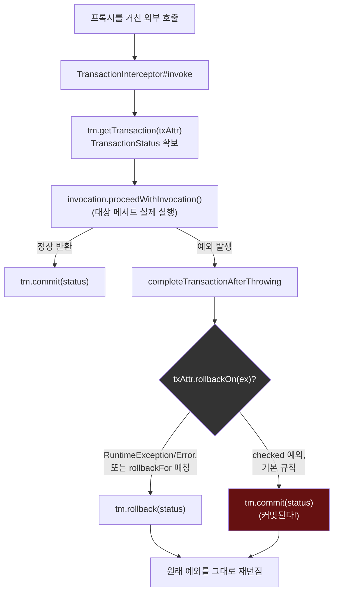
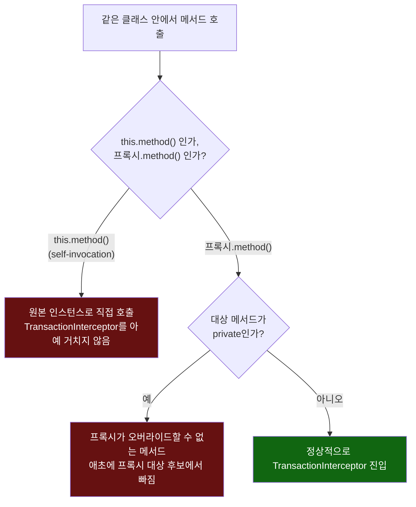

# TransactionInterceptor의 커밋/롤백 분기, 그리고 애초에 거기 도달하지 못하는 경로

[`transactional-internals.md`](../transactional-internals.md)의 6번(호출 흐름) 항목을 시각화한 것. 왼쪽은 정상적으로 프록시를 거친 호출이 커밋/롤백으로 갈리는 지점, 오른쪽은 self-invocation·private 메서드가 이 흐름에 아예 진입하지 못하는 이유다.

