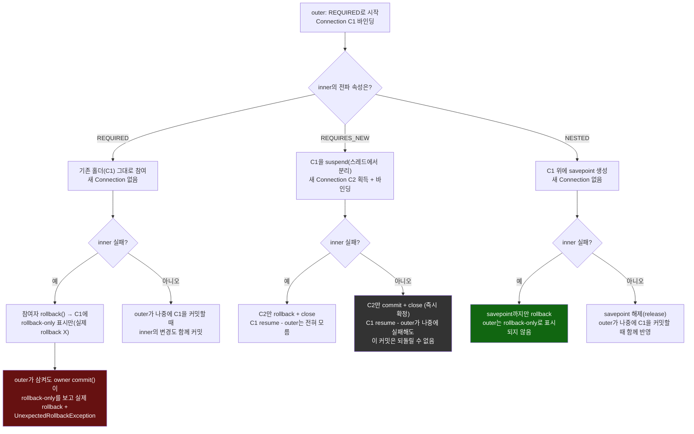

# REQUIRED / REQUIRES_NEW / NESTED, 커넥션이 갈라지는 지점

[`transaction-propagation.md`](../transaction-propagation.md)의 6번(호출 흐름) 항목을 시각화한 것. 세 전파 속성 모두 "바깥 트랜잭션이 이미 하나 떠 있다"는 같은 출발점에서 시작하지만, 물리적 커넥션을 공유하는지, 실패가 바깥까지 번지는지가 완전히 갈린다.

