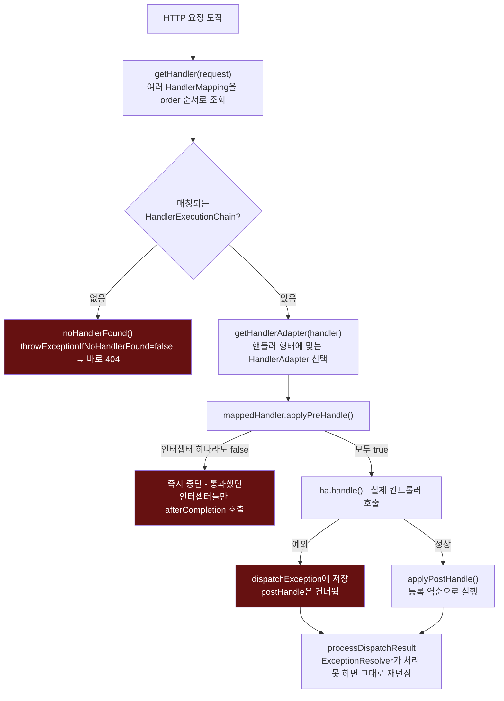

# doDispatch 한 번의 호출 흐름과 갈라지는 지점들

[`dispatcher-servlet.md`](../dispatcher-servlet.md)의 6번(호출 흐름) 항목을 시각화한 것. 왼쪽은 `doDispatch()` 한 번의 전체 경로, 오른쪽은 인터셉터 체인이 preHandle 중단/postHandle 생략을 어떻게 처리하는지다.



```mermaid
sequenceDiagram
    participant DS as DispatcherServlet
    participant Chain as HandlerExecutionChain
    participant I1 as Interceptor1 (preHandle=true)
    participant I2 as Interceptor2 (preHandle=false)
    participant Ctrl as Controller

    DS->>Chain: applyPreHandle()
    Chain->>I1: preHandle()
    I1-->>Chain: true (interceptorIndex=0)
    Chain->>I2: preHandle()
    I2-->>Chain: false
    Chain->>Chain: triggerAfterCompletion(interceptorIndex=0)
    Chain->>I1: afterCompletion()
    Note over I1,Ctrl: Controller는 전혀 호출되지 않는다 -<br/>하지만 I1의 afterCompletion은 실행된다
    Chain-->>DS: false
    DS->>DS: return (더 이상 진행 안 함)
