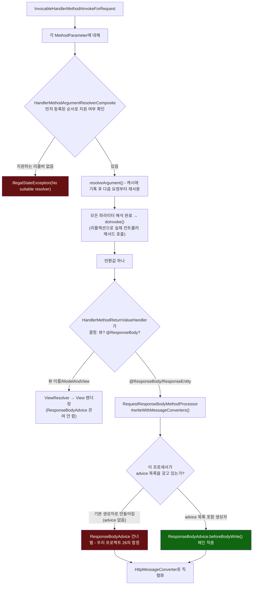

# 인자 해석과 반환값 처리, 그리고 ResponseBodyAdvice가 끼어드는 지점

[`controller-invocation.md`](../controller-invocation.md)의 6번(호출 흐름) 항목을 시각화한 것. 왼쪽은 인자 해석 파이프라인(15주차 HandlerMapping/HandlerAdapter 다음 단계), 오른쪽은 반환값이 두 갈래(뷰 vs `@ResponseBody`)로 갈리고 `ResponseBodyAdvice`가 그중 한쪽에만 끼어드는 지점이다.

