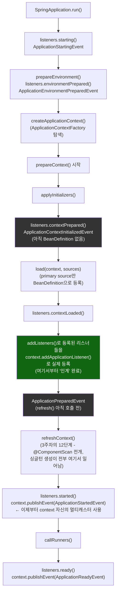

# 두 개의 멀티캐스터, 그리고 두 종류의 리스너가 받는 이벤트가 갈리는 지점

[`spring-application.md`](../spring-application.md)의 6번(호출 흐름) 항목을 시각화한 것. 왼쪽은 `initialMulticaster`에서 `context`의 정규 이벤트 발행 경로로 "인계"가 일어나는 지점, 오른쪽은 그 결과로 두 종류의 리스너가 받는 이벤트 집합이 갈리는 것이다.



```mermaid
sequenceDiagram
    participant App as SpringApplication
    participant Init as initialMulticaster
    participant Ctx as ApplicationContext (자신의 멀티캐스터)
    participant L1 as LifecycleObserver (addListeners)
    participant L2 as BeanRegisteredObserver (@Component)

    App->>Init: ApplicationStartingEvent
    Init->>L1: onApplicationEvent()
    Note over L2: 아직 존재하지 않음 - 받을 수 없음

    App->>Init: ApplicationEnvironmentPreparedEvent
    Init->>L1: onApplicationEvent()
    Note over L2: 아직 존재하지 않음

    App->>Init: ApplicationContextInitializedEvent
    Init->>L1: onApplicationEvent()
    Note over L2: BeanDefinition조차 없음

    App->>Ctx: contextLoaded() - addApplicationListener(L1)
    App->>Init: ApplicationPreparedEvent
    Init->>L1: onApplicationEvent()
    Note over L2: refresh() 전이라 아직 존재하지 않음

    App->>Ctx: refreshContext() - 이 안에서 L2가 빈으로 생성됨

    App->>Ctx: context.publishEvent(ApplicationStartedEvent)
    Ctx->>L1: onApplicationEvent()
    Ctx->>L2: onApplicationEvent()
    Note over L1,L2: 이제부터는 둘 다 받는다
