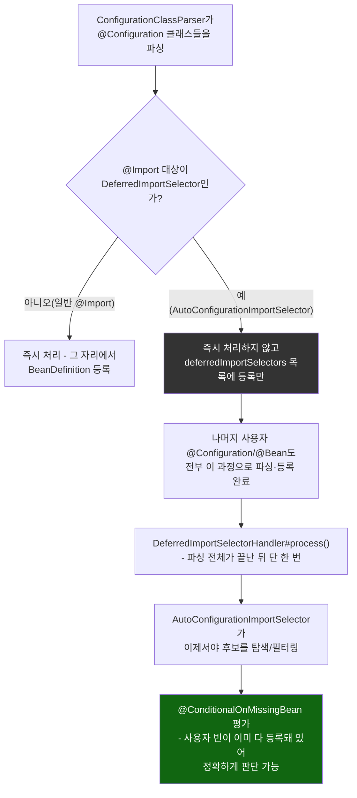
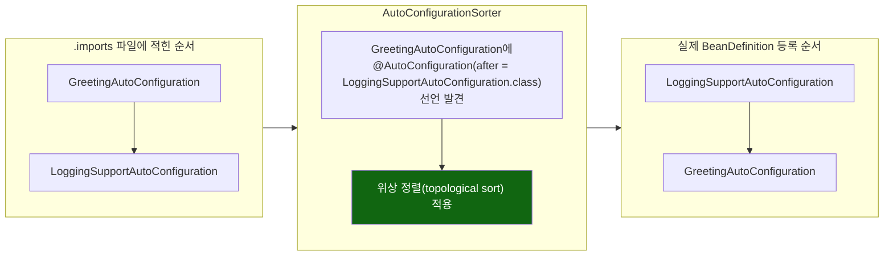

# DeferredImportSelector의 지연 처리와 후보 재정렬

[`auto-configuration.md`](../auto-configuration.md)의 6번(호출 흐름) 항목을 시각화한 것. 왼쪽은 "왜 자동 설정이 사용자 설정보다 항상 나중에 평가되는가"를 결정하는 지연 처리 타이밍, 오른쪽은 후보 목록이 파일 순서에서 최종 순서로 재정렬되는 과정이다.

