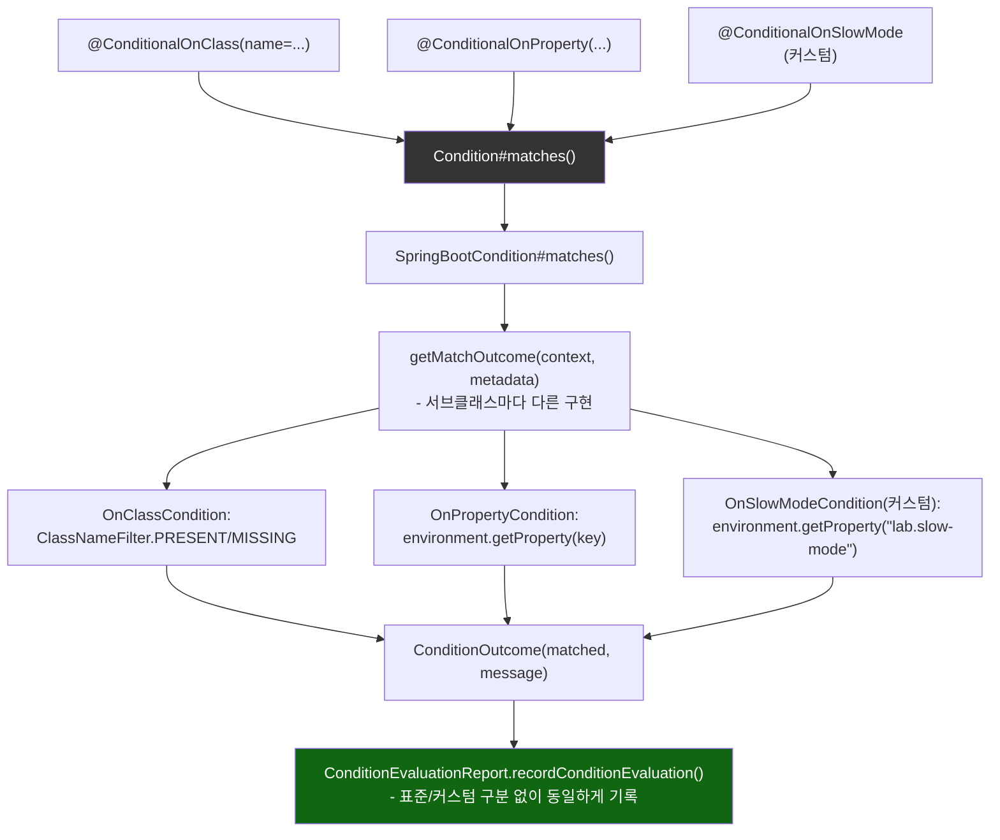

# 표준 조건과 커스텀 조건이 같은 리포트로 수렴하는 지점

[`conditional-configuration.md`](../conditional-configuration.md)의 6번(호출 흐름) 항목을 시각화한 것. 서로 다른 애노테이션(`@ConditionalOnClass`/`@ConditionalOnProperty`/커스텀 `@ConditionalOnSlowMode`)이 전부 같은 `SpringBootCondition` 계약을 거쳐 같은 `ConditionEvaluationReport`로 모인다.

