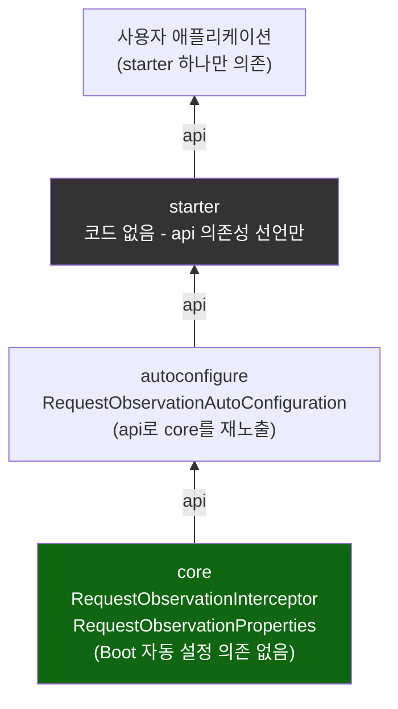
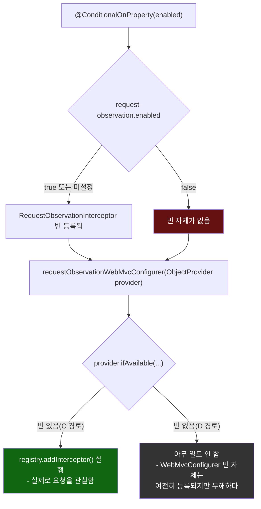

# 3모듈 의존 방향과 ObjectProvider의 안전망 역할

[`custom-starter.md`](../custom-starter.md)의 6번(호출 흐름) 항목을 시각화한 것. 왼쪽은 세 모듈의 의존 방향(항상 아래에서 위로만), 오른쪽은 `@ConditionalOnMissingBean`이 불일치할 때 `ObjectProvider`가 어떻게 배선을 안전하게 지켜 주는지다.

