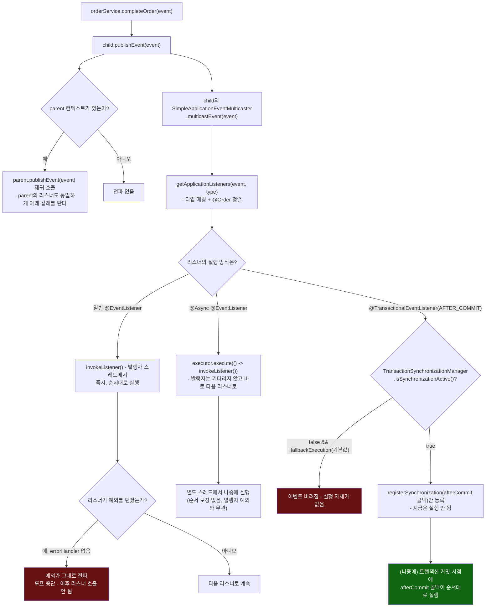

# 이벤트 하나가 발행된 뒤 세 갈래로 갈라지는 지점

[`application-events.md`](../application-events.md)의 6번(호출 흐름) 항목을 시각화한 것. `publishEvent()` 호출 하나가 리스너의 등록 방식(동기/`@Async`/`@TransactionalEventListener`)에 따라 완전히 다른 실행 시점을 갖는다는 것, 그리고 부모 컨텍스트로의 재귀 전파가 이와 별개로 항상 일어난다는 것을 함께 보여준다.

