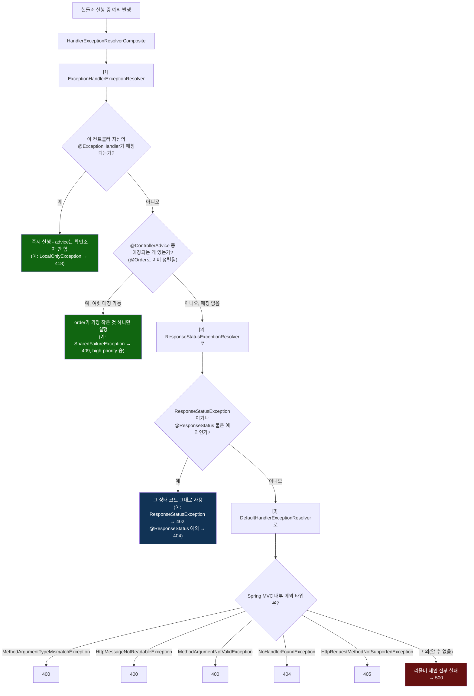

# 예외 하나가 세 리졸버 중 어디서 멈추는가

[`mvc-exception-handling.md`](../mvc-exception-handling.md)의 6번(호출 흐름)·8번(런타임 관찰) 항목을 시각화한 것. `HandlerExceptionResolverComposite`는 등록된 순서대로 리졸버를 시도하다가, 하나라도 `ModelAndView`를 반환하면 그 자리에서 멈춘다 - 뒤쪽 리졸버는 앞쪽이 전부 손을 뗐을 때만 기회를 얻는다.

