# Dual write vs Outbox — 실패가 유실로 이어지는지 여부

[`transactional-outbox.md`](../transactional-outbox.md)의 6번(호출 흐름)·8번(런타임 관찰) 항목을 시각화한 것. 두 접근 모두 "DB 저장 + 메시지 발행"을 하려고 하지만, 발행 실패를 다루는 방식이 완전히 갈린다 - 하나는 영구 유실로, 하나는 재시도 가능한 상태로 끝난다.

```mermaid
flowchart TD
    subgraph Naive["Dual write - NaiveOrderService"]
        A1["@Transactional 시작"] --> A2["orderRepository.save()"]
        A2 --> A3["eventPublisher.publishEvent()<br/>- AFTER_COMMIT 콜백만 등록"]
        A3 --> A4["메서드 리턴 → 커밋<br/>(주문은 이미 영구 저장됨)"]
        A4 --> A5["afterCommit 콜백 실행<br/>messageBroker.send() 시도"]
        A5 --> A6{"전송 성공?"}
        A6 -->|예| A7["끝 - 메시지 전달됨"]
        A6 -->|아니오| A8["예외만 발생하고 끝<br/>durable한 기록이 전혀 없음"]
    end

    subgraph Outbox["Outbox - OutboxOrderService + OutboxPublisher"]
        B1["@Transactional 시작"] --> B2["orderRepository.save()"]
        B2 --> B3["outboxRepository.save(published=false)<br/>- 같은 트랜잭션"]
        B3 --> B4["커밋 - 주문과 아웃박스 이벤트가<br/>함께 있거나 함께 없거나"]
        B4 --> B5["(나중에, 별도 폴링) publishPending()"]
        B5 --> B6["messageBroker.send() 시도"]
        B6 --> B7{"전송 성공?"}
        B7 -->|예| B8["markPublished() - 다음 폴링에서 제외"]
        B7 -->|아니오| B9["아무것도 안 함<br/>published=false 그대로 남음"]
        B9 --> B10["다음 폴링에서 findUnpublished()가<br/>이 이벤트를 다시 찾아 재시도"]
    end

    style A8 fill:#611,color:#fff
    style B9 fill:#333,color:#fff
    style B10 fill:#161,color:#fff
```

