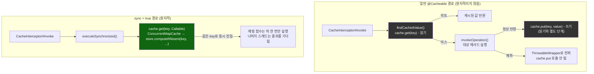
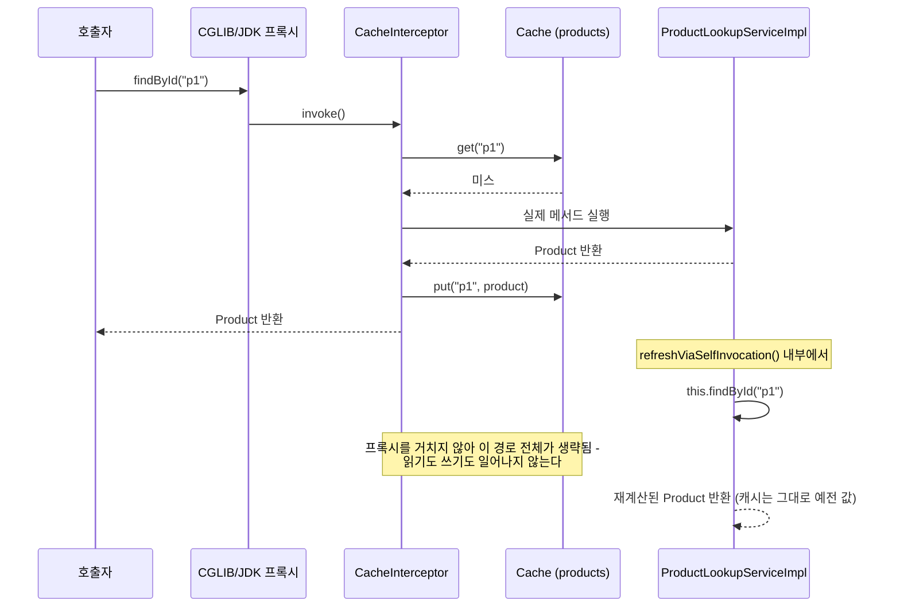

# 일반 경로 vs sync 경로, 그리고 self-invocation이 프록시 경계를 건너뛰는 지점

[`cache-abstraction.md`](../cache-abstraction.md)의 6번(호출 흐름) 항목을 시각화한 것. 왼쪽은 일반 `@Cacheable`의 "조회 후 계산 후 쓰기"가 세 단계로 분리되어 있어 원자적이지 않다는 것, 오른쪽은 `sync = true`가 `Cache#get(key, Callable)` 하나로 조회·계산·쓰기를 위임해 원자성을 얻는다는 것을 대비시킨다.

