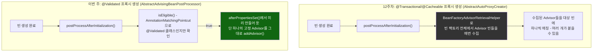
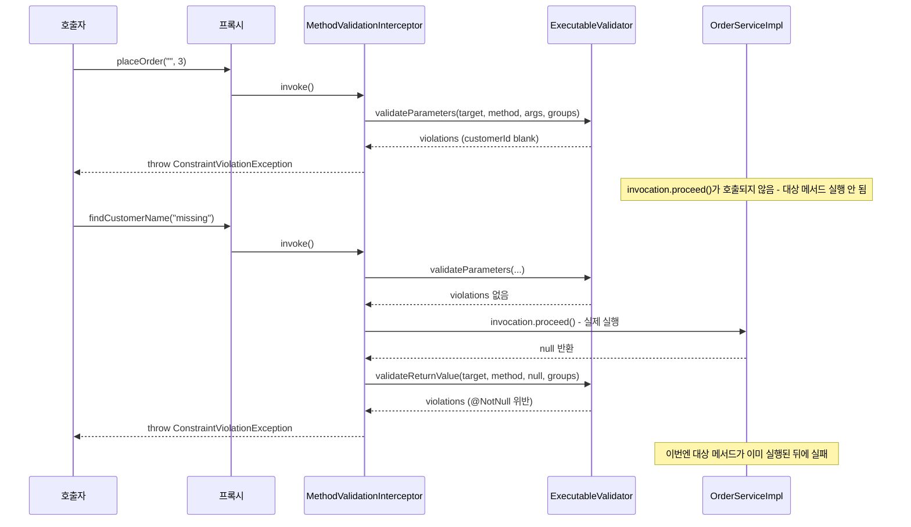

# 프록시 생성 경로 비교, 그리고 파라미터/반환값 검증의 시점 차이

[`method-validation.md`](../method-validation.md)의 6번(호출 흐름)·9번(공식 소스 확인) 항목을 시각화한 것. 위쪽은 `@Validated` 클래스가 프록시가 되는 경로가 12주차의 `AnnotationAwareAspectJAutoProxyCreator`와 왜 다른지, 아래쪽은 검증 실패가 "대상 메서드 실행 전"과 "실행 후" 중 어디서 갈리는지를 대비시킨다.

