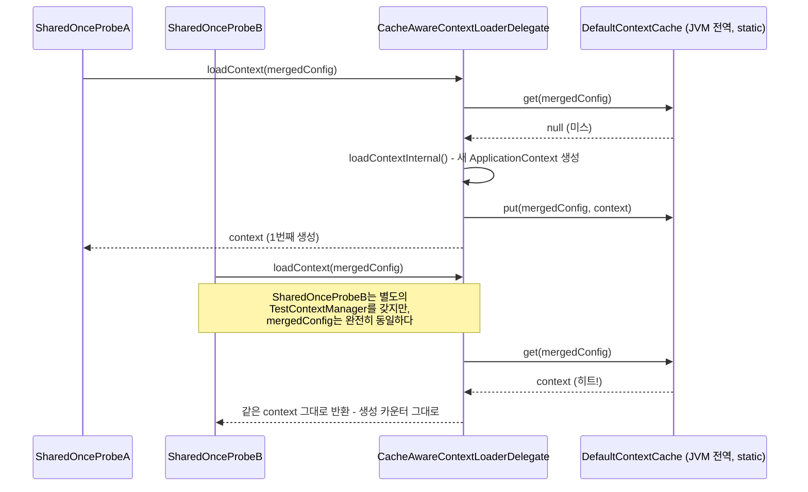
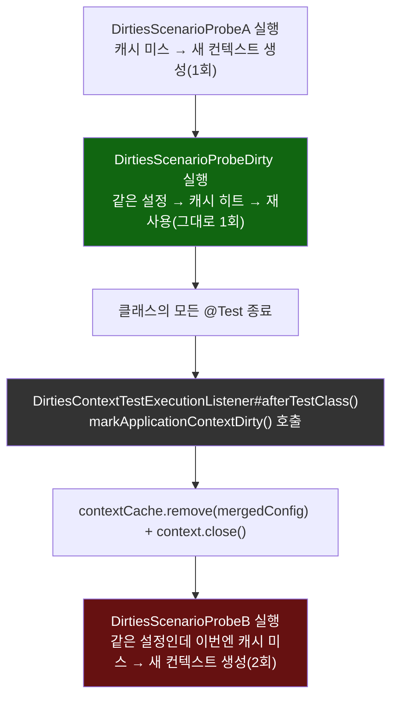

# 캐시 히트/미스 경로, 그리고 @DirtiesContext의 "마킹 후 지연 제거"

[`test-context-caching.md`](../test-context-caching.md)의 6번(호출 흐름)·8번(런타임 관찰) 항목을 시각화한 것. 위쪽은 두 테스트 클래스가 같은 설정을 쓸 때 get-or-create가 어떻게 하나의 컨텍스트로 수렴하는지, 아래쪽은 `@DirtiesContext`가 표시된 클래스 자신은 여전히 캐시를 재사용하고, 그 클래스가 끝난 "뒤"에야 실제 제거가 일어난다는 시차를 보여준다.

