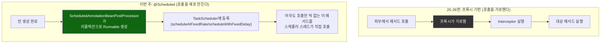

# 프록시 없는 등록 경로, 그리고 단일 스레드 위에서 fixedRate와 fixedDelay가 갈라지는 지점

[`scheduled-tasks.md`](../scheduled-tasks.md)의 6번(호출 흐름)·8번(런타임 관찰) 항목을 시각화한 것. 위쪽은 `@Scheduled`가 25·26번의 인터셉터 경로와 구조적으로 다르다는 것(가로챌 호출이 없다), 아래쪽은 실행 시간이 주기보다 길 때 두 모드의 시작 시각 간격이 왜 벌어지는지를 대비시킨다.

```mermaid
gantt
    dateFormat X
    axisFormat %Lms
    title 단일 스레드 위에서의 시작 시각 (실행 250ms, 회색 = 실행 중)

    section fixedRate(50ms)
    실행 1 :active, r1, 0, 250
    실행 2 :active, r2, 250, 500
    실행 3 :active, r3, 500, 750

    section fixedDelay(250ms)
    실행 1 :active, d1, 0, 250
    대기(delay) :crit, dw1, 250, 500
    실행 2 :active, d2, 500, 750
    대기(delay) :crit, dw2, 750, 1000
    실행 3 :active, d3, 1000, 1250
```

