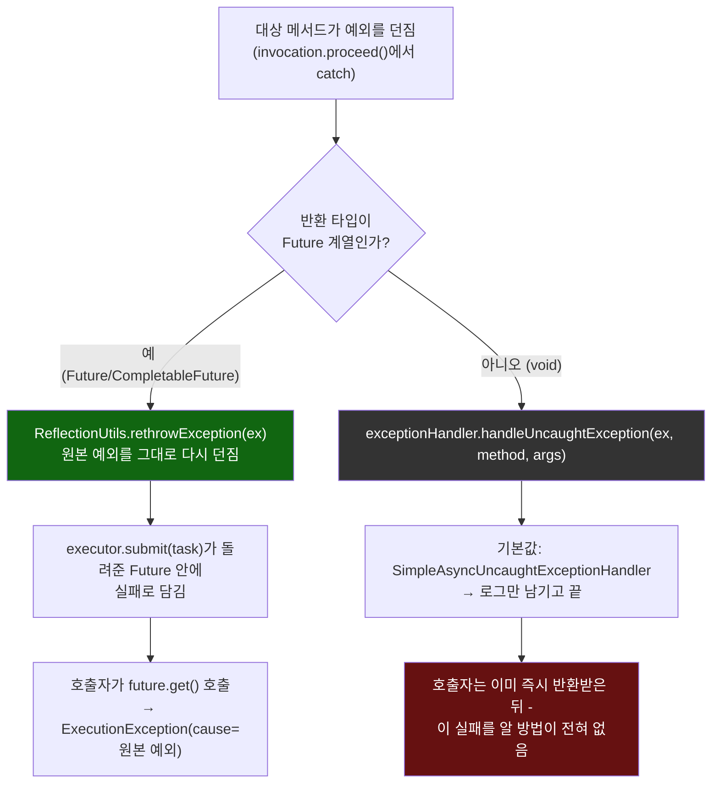
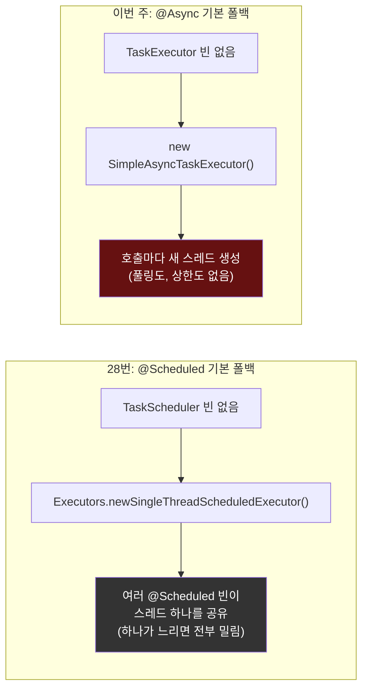

# 반환 타입에 따라 갈라지는 예외 경로, 그리고 28번과 정반대인 기본 실행자

[`async-methods.md`](../async-methods.md)의 6번(호출 흐름)·11번(설계 의도) 항목을 시각화한 것. 위쪽은 같은 예외가 반환 타입에 따라 완전히 다른 두 경로로 갈라지는 것, 아래쪽은 `@Scheduled`(28번)의 "스레드 하나 공유"와 `@Async`의 "호출마다 새 스레드"가 같은 상황("실행자 미설정")에서 정반대 기본값을 택했다는 것을 대비시킨다.

