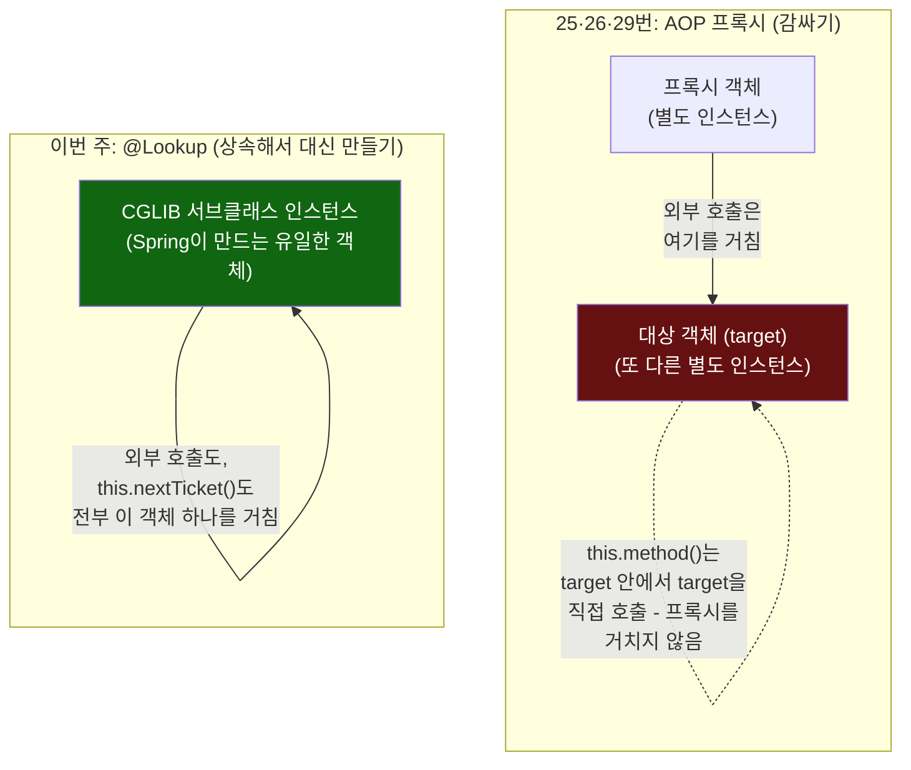
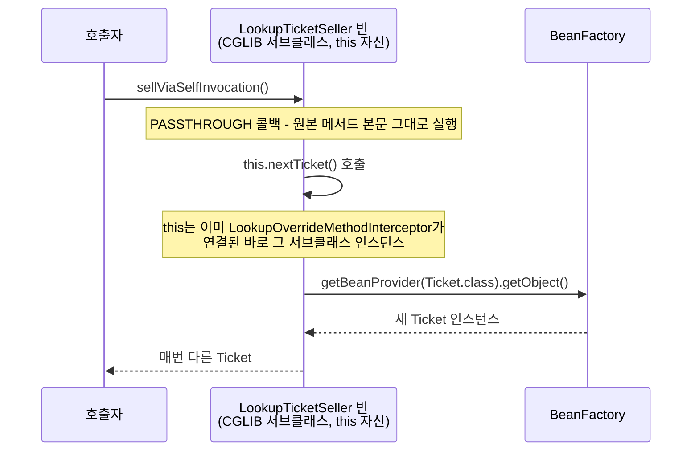

# "감싸는 프록시" vs "상속해서 대신 만든 객체" — self-invocation이 갈리는 지점

[`lookup-method-injection.md`](../lookup-method-injection.md)의 6번(호출 흐름)·11번(설계 의도) 항목을 시각화한 것. 왼쪽(25·26·29번)은 대상 객체와 프록시가 서로 다른 두 개체라서 `this` 호출이 프록시를 우회하고, 오른쪽(이번 주)은 Spring이 만드는 유일한 객체 자체가 이미 오버라이드된 서브클래스라서 `this` 호출도 그대로 오버라이드를 탄다.

