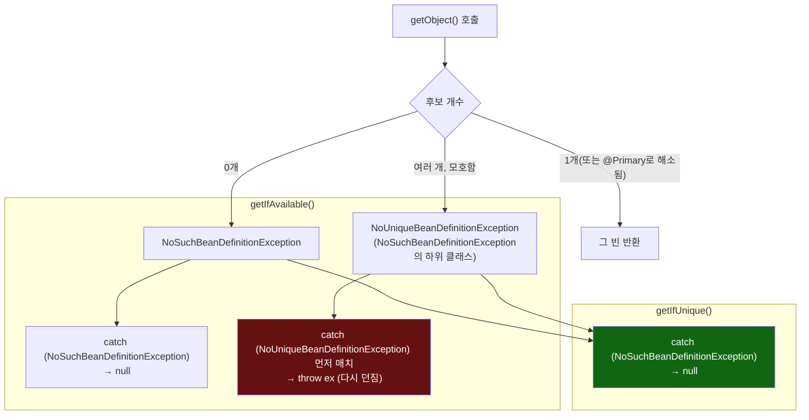

# catch 블록 순서 하나가 "없음"과 "모호함"을 갈라놓는 지점

[`object-provider.md`](../object-provider.md)의 6번(호출 흐름)·9번(공식 소스 확인) 항목을 시각화한 것. `getIfAvailable()`은 `NoUniqueBeanDefinitionException`을 먼저(더 구체적으로) 잡아서 다시 던지고, `getIfUnique()`는 그 가드가 아예 없어서 상위 타입 catch 하나가 두 실패를 모두 흡수한다.

