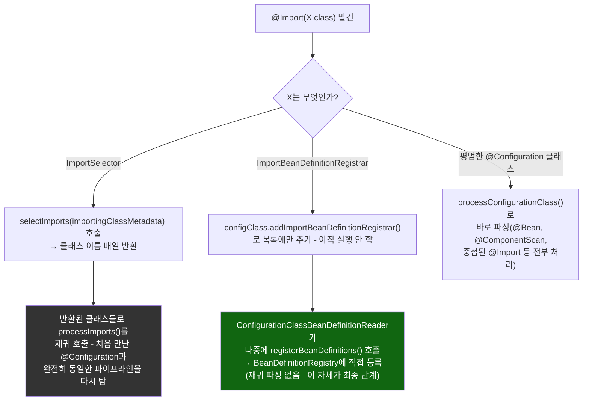
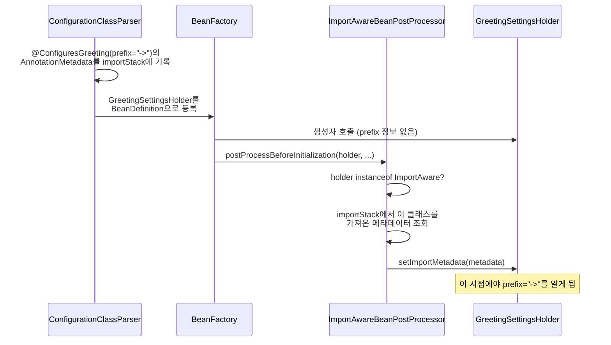

# 세 가지 @Import 대상이 갈라지는 지점, 그리고 ImportAware의 별도 콜백 타이밍

[`import-selector.md`](../import-selector.md)의 6번(호출 흐름)·9번(공식 소스 확인) 항목을 시각화한 것. `ConfigurationClassParser#processImports`가 `@Import` 값 하나하나를 `instanceof`로 구분해서 서로 다른 세 경로로 보내는 지점, 그리고 `ImportAware`가 일반 DI 경로가 아니라 별도의 `BeanPostProcessor` 콜백으로 처리되는 지점을 함께 그렸다.

