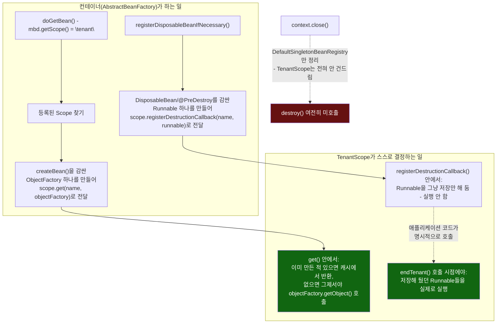

# 컨테이너가 넘겨주는 것 vs TenantScope가 스스로 결정하는 것

[`custom-scope.md`](../custom-scope.md)의 6번(호출 흐름)·9번(공식 소스 확인) 항목을 시각화한 것. 컨테이너(`AbstractBeanFactory`)가 `ObjectFactory`와 소멸 `Runnable`을 "만들어서 넘겨주는" 지점까지는 공통이지만, 그걸 캐싱할지·언제 실행할지는 전부 `TenantScope` 내부의 결정이라는 경계를 보여준다.

