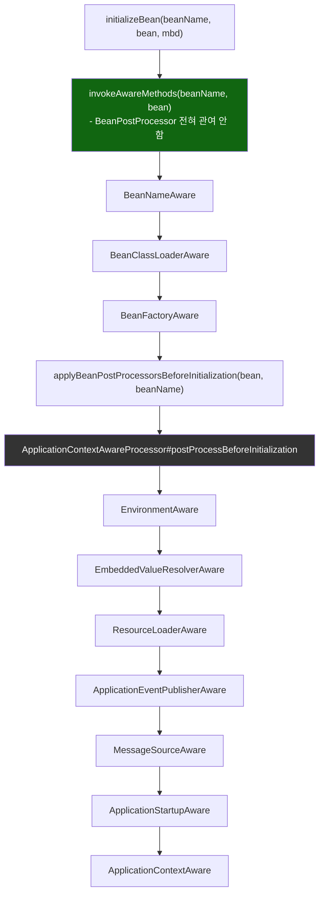
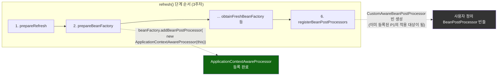

# 직접 호출 셋 vs BeanPostProcessor 위임 일곱, 그리고 등록 타이밍

[`aware-callbacks.md`](../aware-callbacks.md)의 6번(호출 흐름)·8번(런타임 관찰) 항목을 시각화한 것. 위쪽은 `initializeBean()` 안에서 두 그룹이 갈리는 지점, 아래쪽은 `ApplicationContextAwareProcessor`가 사용자 정의 `BeanPostProcessor` 빈보다 먼저 등록되는 `refresh()` 타이밍을 보여준다.

