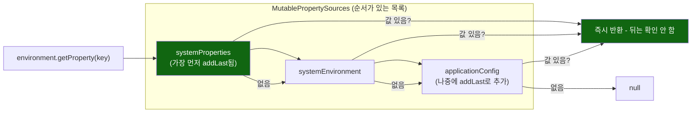

# 위치가 곧 우선순위, 그리고 재귀적으로 풀리는 중첩 플레이스홀더

[`property-source-ordering.md`](../property-source-ordering.md)의 6번(호출 흐름)·8번(런타임 관찰) 항목을 시각화한 것.



```mermaid
flowchart TD
    A["resolvePlaceholders(\"${outer:${inner}}\")"] --> B["\"outer\" 키 조회 → 없음"]
    B --> C["기본값 부분 확인: \"${inner}\"\n그 자체가 플레이스홀더 문법"]
    C --> D["재귀 호출: parseStringValue(\"${inner}\", ...)"]
    D --> E["\"inner\" 키 조회 → \"resolved-inner\""]
    E --> F["바깥쪽 기본값 자리에 그 결과를 대입"]
    F --> G["최종 결과: \"resolved-inner\""]

    style D fill:#333,color:#fff
    style G fill:#161,color:#fff
```
