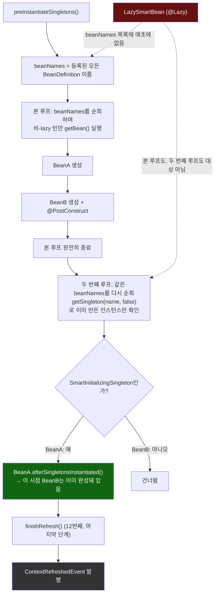

# 본 루프 → 두 번째 루프, 그리고 @Lazy 빈이 둘 다에서 빠지는 지점

[`smart-initializing-singleton.md`](../smart-initializing-singleton.md)의 6번(호출 흐름)·8번(런타임 관찰) 항목을 시각화한 것.

```mermaid
flowchart TD
    A["preInstantiateSingletons()"] --> B["beanNames = 등록된 모든 BeanDefinition 이름"]
    B --> C["본 루프: beanNames를 순회하며\n비-lazy 빈만 getBean() 실행"]
    C --> C1["BeanA 생성"] --> C2["BeanB 생성 + @PostConstruct"]
    C2 --> D["본 루프 완전히 종료"]
    D --> E["두 번째 루프: 같은 beanNames를 다시 순회\ngetSingleton(name, false)로 이미 만든 인스턴스만 확인"]
    E --> F{"SmartInitializingSingleton인가?"}
    F -->|"BeanA: 예"| G["BeanA.afterSingletonsInstantiated()\n→ 이 시점 BeanB는 이미 완성돼 있음"]
    F -->|"BeanB: 아니오"| H["건너뜀"]

    I["LazySmartBean (@Lazy)"] -.->|"beanNames 목록에 애초에 없음"| B
    I -.->|"본 루프도, 두 번째 루프도 대상 아님"| E

    G --> J["finishRefresh() (12번째, 마지막 단계)"]
    J --> K["ContextRefreshedEvent 발행"]

    style G fill:#161,color:#fff
    style I fill:#611,color:#fff
    style K fill:#333,color:#fff
```
