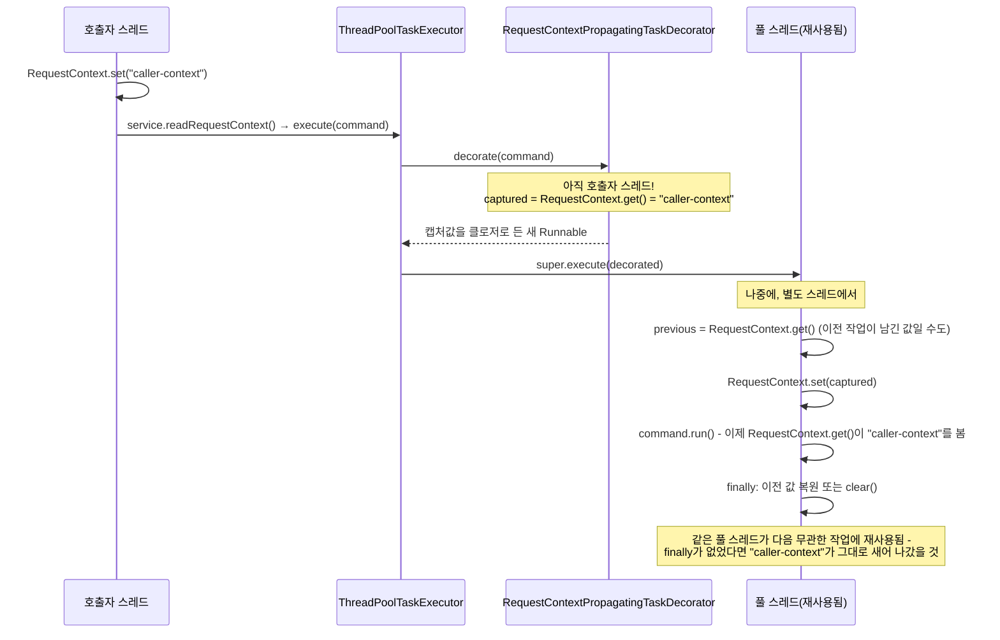

# decorate()는 제출 스레드에서, run()은 풀 스레드에서 - 그리고 재사용이 만드는 누출 위험

[`task-decorator.md`](../task-decorator.md)의 6번(호출 흐름)·8번(런타임 관찰) 항목을 시각화한 것.

```mermaid
sequenceDiagram
    participant Caller as 호출자 스레드
    participant Executor as ThreadPoolTaskExecutor
    participant Decorator as RequestContextPropagatingTaskDecorator
    participant Pool as 풀 스레드(재사용됨)

    Caller->>Caller: RequestContext.set("caller-context")
    Caller->>Executor: service.readRequestContext() → execute(command)
    Executor->>Decorator: decorate(command)
    Note over Decorator: 아직 호출자 스레드!<br/>captured = RequestContext.get() = "caller-context"
    Decorator-->>Executor: 캡처값을 클로저로 든 새 Runnable
    Executor->>Pool: super.execute(decorated)

    Note over Pool: 나중에, 별도 스레드에서
    Pool->>Pool: previous = RequestContext.get() (이전 작업이 남긴 값일 수도)
    Pool->>Pool: RequestContext.set(captured)
    Pool->>Pool: command.run() - 이제 RequestContext.get()이 "caller-context"를 봄
    Pool->>Pool: finally: 이전 값 복원 또는 clear()

    Note over Pool: 같은 풀 스레드가 다음 무관한 작업에 재사용됨 -<br/>finally가 없었다면 "caller-context"가 그대로 새어 나갔을 것
```
