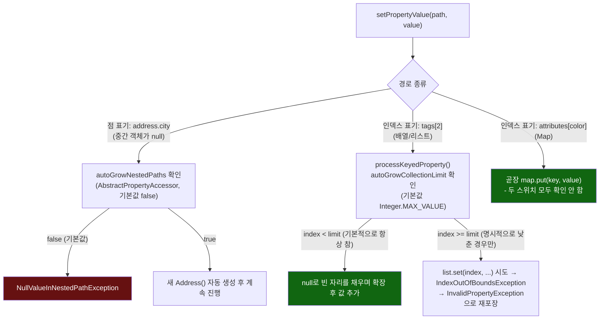

# 두 개의 독립적인 "자동 확장" 스위치, 그리고 조회 경로와 설정 경로의 차이

[`bean-wrapper.md`](../bean-wrapper.md)의 6번(호출 흐름)·9번(공식 소스 확인) 항목을 시각화한 것.

```mermaid
flowchart TD
    A["setPropertyValue(path, value)"] --> B{"경로 종류"}

    B -->|"점 표기: address.city\n(중간 객체가 null)"| C["autoGrowNestedPaths 확인\n(AbstractPropertyAccessor, 기본값 false)"]
    C -->|"false (기본값)"| C1["NullValueInNestedPathException"]
    C -->|"true"| C2["새 Address() 자동 생성 후 계속 진행"]

    B -->|"인덱스 표기: tags[2]\n(배열/리스트)"| D["processKeyedProperty()\nautoGrowCollectionLimit 확인\n(기본값 Integer.MAX_VALUE)"]
    D -->|"index < limit (기본적으로 항상 참)"| D1["null로 빈 자리를 채우며 확장 후 값 추가"]
    D -->|"index >= limit (명시적으로 낮춘 경우만)"| D2["list.set(index, ...) 시도 → IndexOutOfBoundsException\n→ InvalidPropertyException으로 재포장"]

    B -->|"인덱스 표기: attributes[color]\n(Map)"| E["곧장 map.put(key, value)\n- 두 스위치 모두 확인 안 함"]

    style C1 fill:#611,color:#fff
    style D1 fill:#161,color:#fff
    style E fill:#161,color:#fff
```
