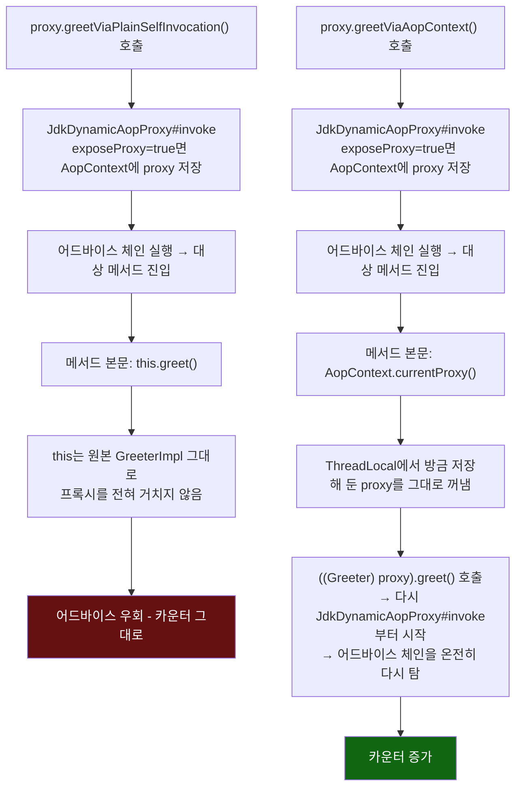

# this.method()(여전히 우회) vs AopContext.currentProxy().method()(정상 적용)

[`expose-proxy.md`](../expose-proxy.md)의 6번(호출 흐름)·8번(런타임 관찰) 항목을 시각화한 것.

```mermaid
flowchart TD
    A["proxy.greetViaPlainSelfInvocation() 호출"] --> B["JdkDynamicAopProxy#invoke\nexposeProxy=true면 AopContext에 proxy 저장"]
    B --> C["어드바이스 체인 실행 → 대상 메서드 진입"]
    C --> D["메서드 본문: this.greet()"]
    D --> E["this는 원본 GreeterImpl 그대로\n프록시를 전혀 거치지 않음"]
    E --> F["어드바이스 우회 - 카운터 그대로"]

    A2["proxy.greetViaAopContext() 호출"] --> B2["JdkDynamicAopProxy#invoke\nexposeProxy=true면 AopContext에 proxy 저장"]
    B2 --> C2["어드바이스 체인 실행 → 대상 메서드 진입"]
    C2 --> D2["메서드 본문: AopContext.currentProxy()"]
    D2 --> E2["ThreadLocal에서 방금 저장해 둔 proxy를 그대로 꺼냄"]
    E2 --> F2["((Greeter) proxy).greet() 호출\n→ 다시 JdkDynamicAopProxy#invoke부터 시작\n→ 어드바이스 체인을 온전히 다시 탐"]
    F2 --> G2["카운터 증가"]

    style F fill:#611,color:#fff
    style G2 fill:#161,color:#fff
```
