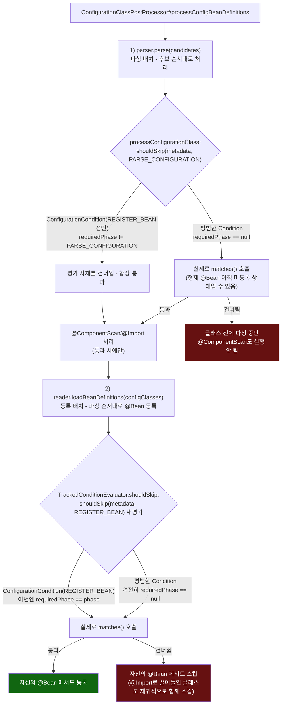
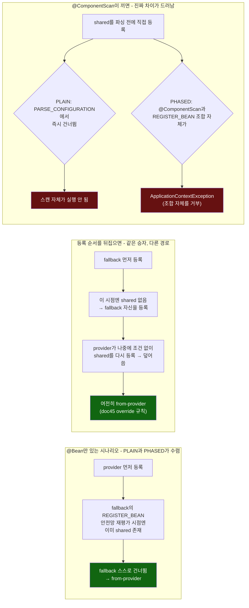

# PARSE_CONFIGURATION vs REGISTER_BEAN — 같은 조건이 두 번 평가되는 이유

[`configuration-condition-phase.md`](../configuration-condition-phase.md)의 6번(호출 흐름)·8번(런타임 관찰) 항목을 시각화한 것.

```mermaid
flowchart TD
    A["ConfigurationClassPostProcessor#processConfigBeanDefinitions"] --> B["1) parser.parse(candidates)\n파싱 배치 - 후보 순서대로 처리"]

    B --> C{"processConfigurationClass:\nshouldSkip(metadata, PARSE_CONFIGURATION)"}
    C -->|"ConfigurationCondition(REGISTER_BEAN 선언)\nrequiredPhase != PARSE_CONFIGURATION"| D["평가 자체를 건너뜀 - 항상 통과"]
    C -->|"평범한 Condition\nrequiredPhase == null"| E["실제로 matches() 호출\n(형제 @Bean 아직 미등록 상태일 수 있음)"]

    D --> F["@ComponentScan/@Import 처리\n(통과 시에만)"]
    E -->|"통과"| F
    E -->|"건너뜀"| G["클래스 전체 파싱 중단\n@ComponentScan도 실행 안 됨"]

    F --> H["2) reader.loadBeanDefinitions(configClasses)\n등록 배치 - 파싱 순서대로 @Bean 등록"]
    H --> I{"TrackedConditionEvaluator.shouldSkip:\nshouldSkip(metadata, REGISTER_BEAN) 재평가"}
    I -->|"ConfigurationCondition(REGISTER_BEAN)\n이번엔 requiredPhase == phase"| J["실제로 matches() 호출"]
    I -->|"평범한 Condition\n여전히 requiredPhase == null"| J

    J -->|"통과"| K["자신의 @Bean 메서드 등록"]
    J -->|"건너뜀"| L["자신의 @Bean 메서드 스킵\n(@Import로 끌어들인 클래스도 재귀적으로 함께 스킵)"]

    style G fill:#611,color:#fff
    style L fill:#611,color:#fff
    style K fill:#161,color:#fff
```

```mermaid
flowchart LR
    subgraph S1["@Bean만 있는 시나리오 - PLAIN과 PHASED가 수렴"]
        direction TB
        A1["provider 먼저 등록"] --> A2["fallback의 REGISTER_BEAN\n안전망 재평가 시점엔\n이미 shared 존재"]
        A2 --> A3["fallback 스스로 건너뜀\n→ from-provider"]
    end

    subgraph S2["등록 순서를 뒤집으면 - 같은 승자, 다른 경로"]
        direction TB
        B1["fallback 먼저 등록"] --> B2["이 시점엔 shared 없음\n→ fallback 자신을 등록"]
        B2 --> B3["provider가 나중에 조건 없이\nshared를 다시 등록 → 덮어씀"]
        B3 --> B4["여전히 from-provider\n(doc45 override 규칙)"]
    end

    subgraph S3["@ComponentScan이 끼면 - 진짜 차이가 드러남"]
        direction TB
        C1["shared를 파싱 전에 직접 등록"] --> C2{"PLAIN: PARSE_CONFIGURATION에서\n즉시 건너뜀"}
        C2 --> C3["스캔 자체가 실행 안 됨"]
        C1 --> C4{"PHASED: @ComponentScan과\nREGISTER_BEAN 조합 자체가"}
        C4 --> C5["ApplicationContextException\n(조합 자체를 거부)"]
    end

    style A3 fill:#161,color:#fff
    style B4 fill:#161,color:#fff
    style C3 fill:#611,color:#fff
    style C5 fill:#611,color:#fff
```
