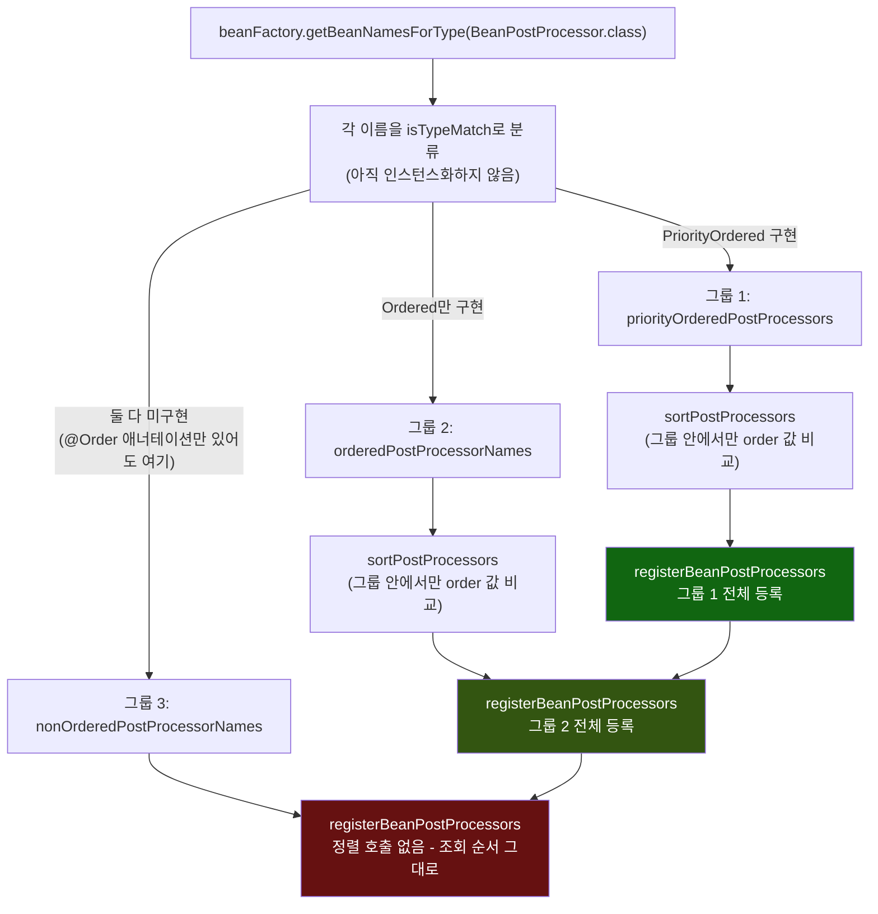
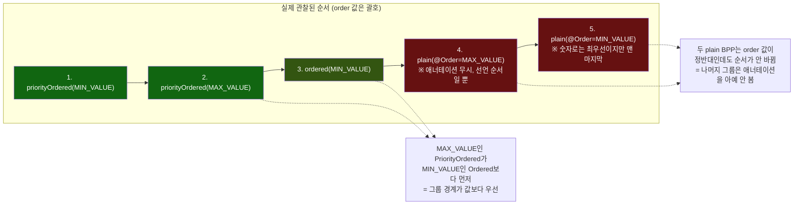

# 그룹 우선, 값은 그다음 — BeanPostProcessor 등록 순서

[`post-processor-ordering.md`](../post-processor-ordering.md)의 6번(호출 흐름)·8번(런타임 관찰) 항목을 시각화한 것.

```mermaid
flowchart TD
    A["beanFactory.getBeanNamesForType(BeanPostProcessor.class)"] --> B["각 이름을 isTypeMatch로 분류\n(아직 인스턴스화하지 않음)"]

    B -->|"PriorityOrdered 구현"| G1["그룹 1: priorityOrderedPostProcessors"]
    B -->|"Ordered만 구현"| G2["그룹 2: orderedPostProcessorNames"]
    B -->|"둘 다 미구현\n(@Order 애너테이션만 있어도 여기)"| G3["그룹 3: nonOrderedPostProcessorNames"]

    G1 --> S1["sortPostProcessors\n(그룹 안에서만 order 값 비교)"]
    S1 --> R1["registerBeanPostProcessors\n그룹 1 전체 등록"]

    G2 --> S2["sortPostProcessors\n(그룹 안에서만 order 값 비교)"]
    S2 --> R2["registerBeanPostProcessors\n그룹 2 전체 등록"]

    G3 --> R3["registerBeanPostProcessors\n정렬 호출 없음 - 조회 순서 그대로"]

    R1 --> R2 --> R3

    style R1 fill:#161,color:#fff
    style R2 fill:#351,color:#fff
    style R3 fill:#611,color:#fff
```

```mermaid
flowchart LR
    subgraph obs["실제 관찰된 순서 (order 값은 괄호)"]
        direction TB
        P1["1. priorityOrdered(MIN_VALUE)"] --> P2["2. priorityOrdered(MAX_VALUE)"]
        P2 --> O1["3. ordered(MIN_VALUE)"]
        O1 --> N1["4. plain(@Order=MAX_VALUE)\n※ 애너테이션 무시, 선언 순서일 뿐"]
        N1 --> N2["5. plain(@Order=MIN_VALUE)\n※ 숫자로는 최우선이지만 맨 마지막"]
    end

    note1["MAX_VALUE인 PriorityOrdered가\nMIN_VALUE인 Ordered보다 먼저\n= 그룹 경계가 값보다 우선"]
    note2["두 plain BPP는 order 값이\n정반대인데도 순서가 안 바뀜\n= 나머지 그룹은 애너테이션을 아예 안 봄"]

    P2 -.-> note1
    O1 -.-> note1
    N1 -.-> note2
    N2 -.-> note2

    style P1 fill:#161,color:#fff
    style P2 fill:#161,color:#fff
    style O1 fill:#351,color:#fff
    style N1 fill:#611,color:#fff
    style N2 fill:#611,color:#fff
```
