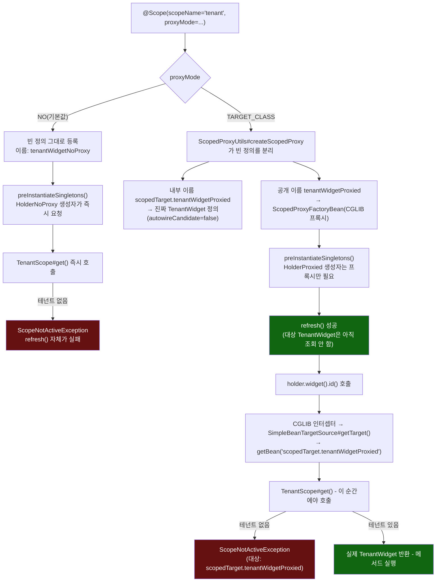
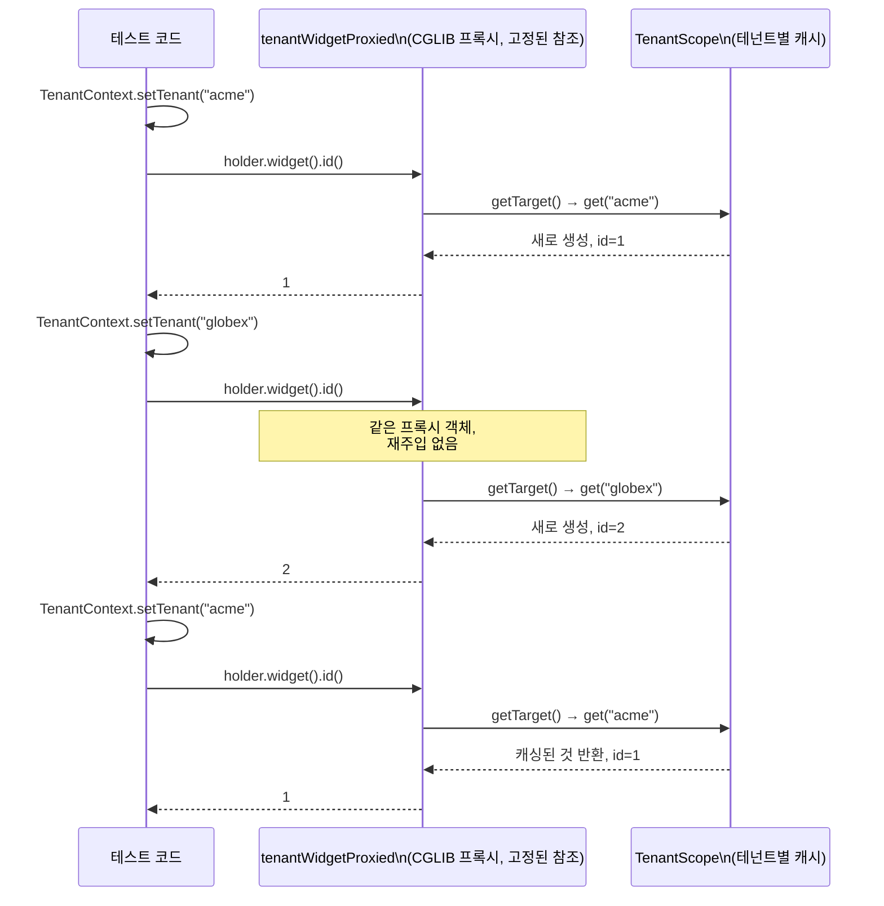

# 실패가 사라지는 게 아니라 옮겨간다 — 스코프드 프록시의 두 갈래 흐름

[`scoped-proxy.md`](../scoped-proxy.md)의 6번(호출 흐름)·8번(런타임 관찰) 항목을 시각화한 것.

```mermaid
flowchart TD
    A["@Scope(scopeName='tenant', proxyMode=...)"] --> B{"proxyMode"}

    B -->|"NO(기본값)"| C["빈 정의 그대로 등록\n이름: tenantWidgetNoProxy"]
    B -->|"TARGET_CLASS"| D["ScopedProxyUtils#createScopedProxy가 빈 정의를 분리"]

    D --> D1["공개 이름 tenantWidgetProxied\n→ ScopedProxyFactoryBean(CGLIB 프록시)"]
    D --> D2["내부 이름 scopedTarget.tenantWidgetProxied\n→ 진짜 TenantWidget 정의(autowireCandidate=false)"]

    C --> E["preInstantiateSingletons()\nHolderNoProxy 생성자가 즉시 요청"]
    E --> F["TenantScope#get() 즉시 호출"]
    F -->|"테넌트 없음"| G["ScopeNotActiveException\nrefresh() 자체가 실패"]

    D1 --> H["preInstantiateSingletons()\nHolderProxied 생성자는 프록시만 필요"]
    H --> I["refresh() 성공\n(대상 TenantWidget은 아직 조회 안 함)"]
    I --> J["holder.widget().id() 호출"]
    J --> K["CGLIB 인터셉터 → SimpleBeanTargetSource#getTarget()\n→ getBean('scopedTarget.tenantWidgetProxied')"]
    K --> L["TenantScope#get() - 이 순간에야 호출"]
    L -->|"테넌트 없음"| M["ScopeNotActiveException\n(대상: scopedTarget.tenantWidgetProxied)"]
    L -->|"테넌트 있음"| N["실제 TenantWidget 반환 - 메서드 실행"]

    style G fill:#611,color:#fff
    style M fill:#611,color:#fff
    style N fill:#161,color:#fff
    style I fill:#161,color:#fff
```

```mermaid
sequenceDiagram
    participant T as 테스트 코드
    participant P as tenantWidgetProxied\n(CGLIB 프록시, 고정된 참조)
    participant S as TenantScope\n(테넌트별 캐시)

    T->>T: TenantContext.setTenant("acme")
    T->>P: holder.widget().id()
    P->>S: getTarget() → get("acme")
    S-->>P: 새로 생성, id=1
    P-->>T: 1

    T->>T: TenantContext.setTenant("globex")
    T->>P: holder.widget().id()
    Note over P: 같은 프록시 객체,<br/>재주입 없음
    P->>S: getTarget() → get("globex")
    S-->>P: 새로 생성, id=2
    P-->>T: 2

    T->>T: TenantContext.setTenant("acme")
    T->>P: holder.widget().id()
    P->>S: getTarget() → get("acme")
    S-->>P: 캐싱된 것 반환, id=1
    P-->>T: 1
```
