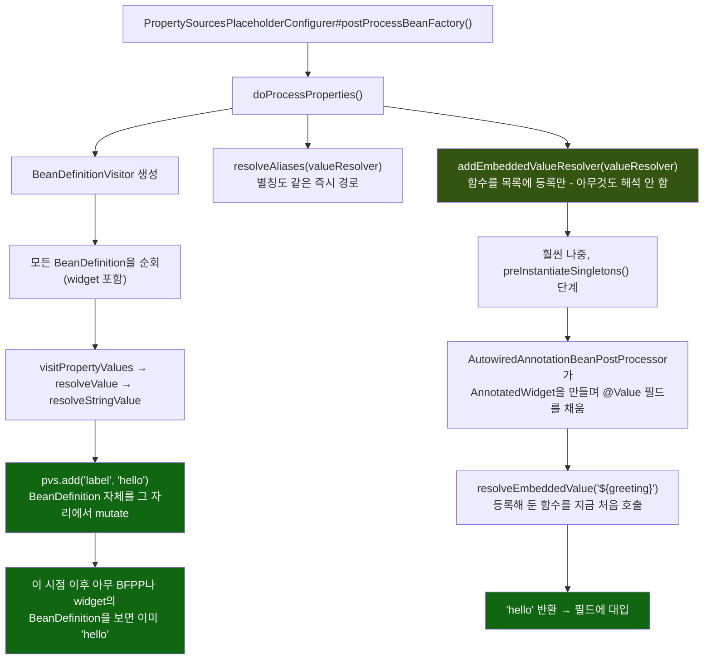
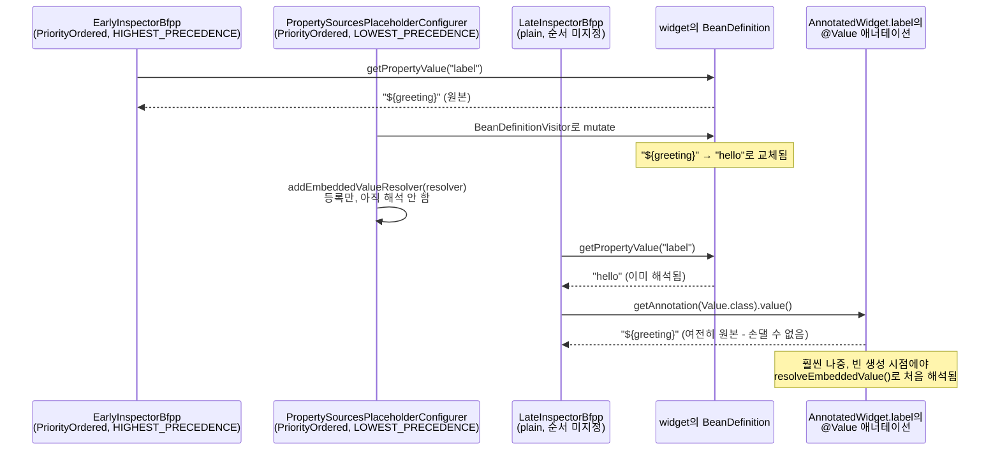

# 즉시·일괄 vs 지연·건별 — `${...}`가 갈라지는 두 경로

[`placeholder-resolution.md`](../placeholder-resolution.md)의 6번(호출 흐름)·8번(런타임 관찰) 항목을 시각화한 것.

```mermaid
flowchart TD
    A["PropertySourcesPlaceholderConfigurer#postProcessBeanFactory()"] --> B["doProcessProperties()"]

    B --> C["BeanDefinitionVisitor 생성"]
    C --> D["모든 BeanDefinition을 순회\n(widget 포함)"]
    D --> E["visitPropertyValues → resolveValue → resolveStringValue"]
    E --> F["pvs.add('label', 'hello')\nBeanDefinition 자체를 그 자리에서 mutate"]

    B --> G["resolveAliases(valueResolver)\n별칭도 같은 즉시 경로"]

    B --> H["addEmbeddedValueResolver(valueResolver)\n함수를 목록에 등록만 - 아무것도 해석 안 함"]

    F --> I["이 시점 이후 아무 BFPP나 widget의\nBeanDefinition을 보면 이미 'hello'"]

    H --> J["훨씬 나중, preInstantiateSingletons() 단계"]
    J --> K["AutowiredAnnotationBeanPostProcessor가\nAnnotatedWidget을 만들며 @Value 필드를 채움"]
    K --> L["resolveEmbeddedValue('${greeting}')\n등록해 둔 함수를 지금 처음 호출"]
    L --> M["'hello' 반환 → 필드에 대입"]

    style F fill:#161,color:#fff
    style I fill:#161,color:#fff
    style H fill:#351,color:#fff
    style M fill:#161,color:#fff
```

```mermaid
sequenceDiagram
    participant Early as EarlyInspectorBfpp<br/>(PriorityOrdered, HIGHEST_PRECEDENCE)
    participant PSPC as PropertySourcesPlaceholderConfigurer<br/>(PriorityOrdered, LOWEST_PRECEDENCE)
    participant Late as LateInspectorBfpp<br/>(plain, 순서 미지정)
    participant Widget as widget의 BeanDefinition
    participant Anno as AnnotatedWidget.label의<br/>@Value 애너테이션

    Early->>Widget: getPropertyValue("label")
    Widget-->>Early: "${greeting}" (원본)

    PSPC->>Widget: BeanDefinitionVisitor로 mutate
    Note over Widget: "${greeting}" → "hello"로 교체됨
    PSPC->>PSPC: addEmbeddedValueResolver(resolver)<br/>등록만, 아직 해석 안 함

    Late->>Widget: getPropertyValue("label")
    Widget-->>Late: "hello" (이미 해석됨)
    Late->>Anno: getAnnotation(Value.class).value()
    Anno-->>Late: "${greeting}" (여전히 원본 - 손댈 수 없음)

    Note over Anno: 훨씬 나중, 빈 생성 시점에야<br/>resolveEmbeddedValue()로 처음 해석됨
```
