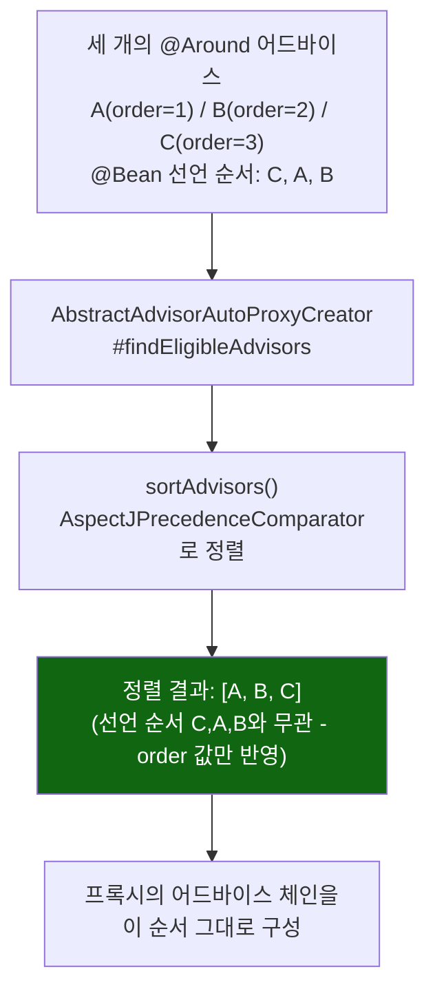
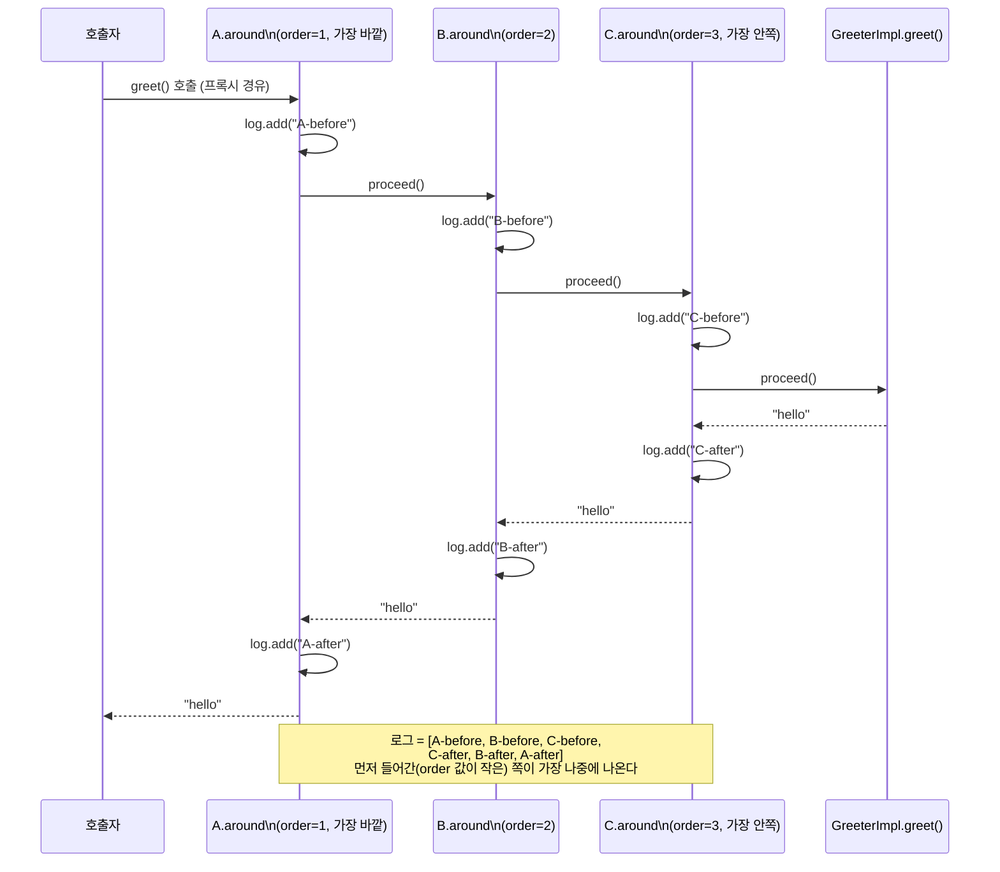

# 양파 껍질 — 여러 @Around 어드바이스의 중첩 순서

[`aspect-ordering.md`](../aspect-ordering.md)의 6번(호출 흐름)·8번(런타임 관찰) 항목을 시각화한 것.

```mermaid
flowchart TD
    A["세 개의 @Around 어드바이스\nA(order=1) / B(order=2) / C(order=3)\n@Bean 선언 순서: C, A, B"] --> B["AbstractAdvisorAutoProxyCreator\n#findEligibleAdvisors"]
    B --> C["sortAdvisors()\nAspectJPrecedenceComparator로 정렬"]
    C --> D["정렬 결과: [A, B, C]\n(선언 순서 C,A,B와 무관 - order 값만 반영)"]
    D --> E["프록시의 어드바이스 체인을\n이 순서 그대로 구성"]

    style D fill:#161,color:#fff
```

```mermaid
sequenceDiagram
    participant Caller as 호출자
    participant A as A.around\n(order=1, 가장 바깥)
    participant B as B.around\n(order=2)
    participant C as C.around\n(order=3, 가장 안쪽)
    participant T as GreeterImpl.greet()

    Caller->>A: greet() 호출 (프록시 경유)
    A->>A: log.add("A-before")
    A->>B: proceed()
    B->>B: log.add("B-before")
    B->>C: proceed()
    C->>C: log.add("C-before")
    C->>T: proceed()
    T-->>C: "hello"
    C->>C: log.add("C-after")
    C-->>B: "hello"
    B->>B: log.add("B-after")
    B-->>A: "hello"
    A->>A: log.add("A-after")
    A-->>Caller: "hello"

    Note over A,C: 로그 = [A-before, B-before, C-before,<br/>C-after, B-after, A-after]<br/>먼저 들어간(order 값이 작은) 쪽이 가장 나중에 나온다
```
