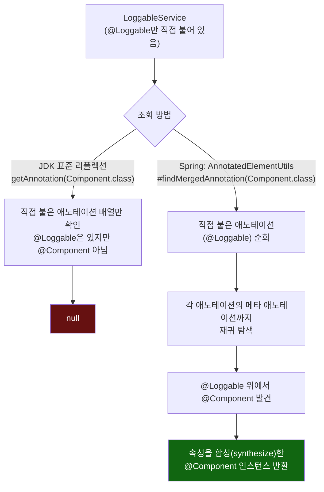

# 리플렉션이 못 보는 것을 Spring은 어떻게 보는가

[`composed-annotation.md`](../composed-annotation.md)의 6번(호출 흐름)·8번(런타임 관찰) 항목을 시각화한 것.



```mermaid
flowchart LR
    subgraph Fast["@Fast 애노테이션 정의"]
        F1["value() default \"fast-lane\"\n@AliasFor(annotation=Qualifier.class,\nattribute=\"value\")"]
    end

    subgraph Usage["실제 사용"]
        U1["@Fast\n(값 미지정 → 기본값 사용)"]
        U2["@Fast(\"turbo\")\n(명시적 값)"]
    end

    subgraph Synthesized["AnnotatedElementUtils가 합성한 @Qualifier"]
        S1["@Qualifier(value=\"fast-lane\")"]
        S2["@Qualifier(value=\"turbo\")"]
    end

    F1 -.정의.-> U1
    F1 -.정의.-> U2
    U1 -->|"합성"| S1
    U2 -->|"합성"| S2

    S2 --> Q["QualifierAnnotationAutowireCandidateResolver\n#checkQualifiers"]
    Q --> R["engineConsumer의 @Fast(\"turbo\")와\nturboEngine의 합성 @Qualifier(\"turbo\")가 일치"]
    R --> Win["turboEngine 확정 선택"]

    style Win fill:#161,color:#fff
```
