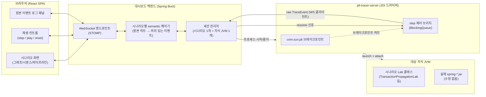

# Spring 학습용 시각화 대시보드 — 설계 문서

`tools/jdi-tracer`가 20주 넘게 쌓아 온 "실제 Spring 소스에 브레이크포인트를 걸고 스택/지역 변수를 관찰한다"는 방식을, 터미널 텍스트가 아니라 브라우저에서 실시간으로 움직이는 그래프/다이어그램으로 보여주는 웹 대시보드의 설계다. 이 저장소에서 이미 검증한 사실(빈 생명주기 순서, 3단계 캐시, AOP 자동 프록시 생성 경로, 트랜잭션 전파, DispatcherServlet 흐름)을 "읽어서 아는 것"에서 "눈으로 보고 손으로 조작하며 체득하는 것"으로 한 단계 끌어올리는 게 목적이다.

**구현 현황**: 8번 절의 0~8단계 전부 구현 완료 — [`tools/learning-dashboard`](../../tools/learning-dashboard). 7개 시나리오(6.1~6.4 + event-multicast + mvc-exception-priority + condition-report)가 모두 라이브로 동작한다 - 설계 문서가 애초에 "범위 밖"으로 미뤄 뒀던 3개 후보(6번 절)까지 전부 구현됐다. condition-report(6.5절)만 다른 시나리오들과 근본적으로 다른 구조다 - JDI 스텝 실행이 아니라 "프로퍼티를 바꿔 다시 실행하고 리포트 트리를 보는" 1회성 구조라 `ScenarioSession`/`TracerServer` 파이프라인을 타지 않는다.

**다음 확장**: 9번 절이 "강한 인터페이스로 플러그인화를 미리 설계하지 않는다"고 못 박아 뒀던 전제를, 시나리오 7개를 실제로 만들어 본 뒤 재검토한 결과가 [`04-dynamic-scenario-design.md`](04-dynamic-scenario-design.md)다 - 하드코딩된 `ScenarioCatalog`를 DB 기반으로 바꾸고, 기존 실험 모듈을 브라우저에서 즉석으로 골라 새 시나리오로 등록하거나 아예 새 코드를 작성해 서버가 컴파일·실행하게 하는 설계.

## 0. 결정된 전제

세 가지 핵심 결정을 먼저 확정한다(문서 전체가 이 위에서 갈린다):

1. **상호작용 모델: 라이브 실행.** 사전에 녹화된 트레이스를 재생하는 게 아니라, 버튼을 누르면 실제 자식 JVM에서 Spring 컨텍스트가 그 자리에서 기동/실행되고, JDI 브레이크포인트가 실시간으로 이벤트를 스트리밍한다.
2. **MVP 범위(1단계에서 전부 다룸)**: 빈 생명주기 + 순환 참조, AOP 자동 프록시 생성, 트랜잭션 전파(suspend/resume), DispatcherServlet 요청 흐름 — 네 가지 시나리오.
3. **프론트엔드: React + Vite SPA.**

## 1. 왜 `tools/jdi-tracer`를 확장하는 방식인가

처음 떠오르는 대안은 "Spring 내부 클래스에 커스텀 `BeanPostProcessor`/`Advisor`/`ApplicationListener` 등을 등록해서 이벤트를 수집하는" 방식이다. 하지만 이 방식은 두 가지 근본적인 한계가 있다.

- **관찰 대상이 확장 지점이 있는 곳으로 제한된다.** 3단계 캐시의 `singletonFactories`/`earlySingletonObjects` 전이, `AbstractAutoProxyCreator`가 advisor를 재귀적으로 인스턴스화하는 순간, `AbstractPlatformTransactionManager`의 `suspend(null)` 방어적 호출처럼, **공개 확장 지점이 전혀 없는 프레임워크 내부 로직**은 이 방식으로는 절대 관찰할 수 없다. 지난 세션들에서 jdi-tracer로 실제로 확인한 흥미로운 사실들(예: [`docs/12-auto-proxy-creator`](../12-auto-proxy-creator/auto-proxy-creator.md) 7.1절, [`docs/14-transaction-propagation`](../14-transaction-propagation/transaction-propagation.md) 7.1절)이 전부 여기 해당한다.
- **"진짜로 지금 이 코드가 실행되고 있다"는 신뢰가 약해진다.** BeanPostProcessor 기반 수집은 결국 "Spring이 이렇게 동작한다고 알려진 것을 흉내 낸 코드"가 이벤트를 만드는 것이라, 소스 리딩과 실행 관찰 사이의 간극이 다시 생긴다. JDI는 **원본 `spring-*.jar`를 한 줄도 건드리지 않고** 실제 실행 중인 바이트코드에 브레이크포인트를 건다 — 이 저장소 전체의 방법론("추측하지 말고 확인하라", `docs/plan/00-methodology.md`)과 가장 잘 맞는 방식이다.

그래서 이 설계의 핵심은: **`tools/jdi-tracer`의 엔진(JDI 브레이크포인트 + 스택/지역 변수 캡처)은 그대로 재사용하고, 출력 형태만 "콘솔에 프린트하고 즉시 resume"에서 "구조화된 JSON을 스트리밍하고, 사용자가 다음 히트를 요청할 때까지 resume을 미루는"으로 바꾼다.** 게다가 각 시나리오의 대상 코드(`TransactionPropagationLab`, `AutoProxyCreationLab` 등)와 브레이크포인트 스펙(`tools/jdi-tracer/specs/*.txt`)은 이미 이전 세션들에서 만들어 둔 것을 그대로 재사용할 수 있다 — 이 대시보드는 완전히 새로 시작하는 프로젝트가 아니라, 이미 쌓아 둔 자산 위에 시각화 계층을 얹는 작업이다.

## 2. 전체 아키텍처



- **대상 자식 JVM**은 지금까지와 똑같이 각 experiments/mini-spring 모듈의 `Lab` 클래스를 `main()`으로 실행한다. 코드 수정 없음.
- **jdi-tracer-server**는 `tools/jdi-tracer`를 확장한 것이다 — 기존 `Tracer.java`의 launch/attach/브레이크포인트 로직은 그대로 두고, `printHit()` 대신 히트를 JSON으로 직렬화해 백엔드로 보내는 출력 어댑터와, "다음 히트까지 자동으로 resume하지 않고 명령을 기다리는" step 제어를 추가한다.
- **대시보드 백엔드**는 (1) 어떤 시나리오를 어떤 Lab 클래스 + 스펙 파일로 실행할지 아는 세션 관리자, (2) 원본 히트를 시나리오별 의미 있는 이벤트로 변환하는 해석기, (3) 브라우저와의 WebSocket 연결을 담당한다.
- **프론트엔드**는 시나리오를 고르고, 재생을 제어하고, 의미 이벤트를 애니메이션으로 그린다.
- 이 다이어그램은 "스텝 실행형" 시나리오(6.1~6.4, event-multicast, mvc-exception-priority)에만
  해당한다 - condition-report(6.5절)는 데이터 소스 자체에 "단계"가 없어서 이 파이프라인을 타지
  않는다(`ScenarioSession`/`TracerServer`를 쓰지 않고 별도의 1회성 실행 경로를 쓴다 - 6.5절 참고).

## 3. 컴포넌트 설계

### 3.1 jdi-tracer-server — 기존 도구의 최소 확장

`tools/jdi-tracer`의 `Tracer.java`는 그대로 두고, 같은 모듈에 새 진입점을 추가한다(기존 CLI 사용법을 절대 깨지 않는다 — 이미 여러 문서에서 `./gradlew :tools:jdi-tracer:run`으로 참조되고 있다).

**바뀌는 것**
- `printHit()`이 하던 일(스택 프레임 추출, `visibleVariables()`/`getValue()`로 지역 변수 요약)을 별도 클래스(`HitSerializer`)로 뽑아내, 콘솔 출력 대신 JSON(`TraceEvent`, 7번 절)으로 직렬화한다.
- 이벤트 루프에서 `eventSet.resume()`을 즉시 호출하는 대신, "다음 히트를 진행해도 좋다"는 신호가 올 때까지 기다린다(`BlockingQueue<StepCommand>`) — 이게 "라이브 실행"을 "재생 가능한" 경험으로 만드는 핵심이다. `play` 모드에서는 백엔드가 이 큐에 일정 간격으로 자동 신호를 넣어 "애니메이션처럼 흘러가는" 효과를 낸다.
- 자식 JVM의 stdout/stderr는 지금처럼 그대로 캡처해서 이벤트 스트림에 `type: "stdout"` 항목으로 함께 흘려보낸다(예: `TransactionPlaygroundConfig`가 남기는 "Starting embedded database" 로그도 프론트엔드 로그 패널에 그대로 보인다).

**바뀌지 않는 것**: 브레이크포인트 스펙 파싱 형식(`Class#method1,method2`), `ClassPrepareRequest`/`BreakpointRequest` 등록 방식, 대상 프로세스 launch 방식 — 전부 기존 그대로 재사용한다.

### 3.2 대시보드 백엔드 (Spring Boot)

- **세션 관리자**: "지금 활성 시나리오 1개"만 허용하는 단순한 모델로 시작한다(4번 절 위험 요소 참고). 시나리오를 시작하면 (1) 대상 클래스패스를 `./gradlew`로 조회 — 이미 각 세션에서 반복해 온 "throwaway 태스크로 `runtimeClasspath.asPath` 출력" 패턴을 백엔드 내부 로직으로 흡수한다 — (2) jdi-tracer-server 프로세스를 `ProcessBuilder`로 띄운다.
- **semantic 해석기**: 시나리오마다 별도 클래스(`BeanLifecycleInterpreter`, `AutoProxyInterpreter`, `TransactionPropagationInterpreter`, `DispatcherFlowInterpreter`)가 원본 `TraceEvent` 스트림을 받아 그 시나리오에 의미 있는 고수준 이벤트로 변환한다(6번 절에서 시나리오별로 구체화). 이 해석기들이 사실상 "이전 세션에서 문서 7.1절에 산문으로 적었던 분석"을 코드로 옮긴 것이다 — 예를 들어 "스택에 `handleExistingTransaction`이 있는 `suspend` 호출만 진짜 suspend다"라는 문장이 그대로 `if (hit.method().equals("suspend") && hit.stack().contains("handleExistingTransaction"))` 판별 로직이 된다.
- **WebSocket**: Spring의 `spring-websocket` + STOMP(`@MessageMapping`/`SimpMessagingTemplate`)를 그대로 쓴다 — 이 저장소가 여태 다루지 않은 Spring 모듈이지만, 그 자체로 "메시징 인프라를 실제로 한번 써 보는" 작은 보너스 학습이 된다(다만 이 설계 문서의 핵심 범위는 아니다).

### 3.3 프론트엔드 (React + Vite)

- **공용 재생 컨트롤 컴포넌트**: step / play(속도 조절) / reset — 네 시나리오 화면이 전부 공유한다.
- **원본 이벤트 로그 패널**: 지금 jdi-tracer CLI가 찍는 것과 같은 정보(히트 번호, 클래스#메서드, 스택, 지역 변수)를 그대로 텍스트로도 보여준다 — 그래프를 못 믿겠으면 언제든 "진짜 로그"로 내려가 확인할 수 있게 하는, 신뢰를 위한 안전장치다.
- **시나리오별 시각화 컴포넌트**(6번 절에서 각각 상세):
  - 빈 생명주기: 그래프(cytoscape.js) — 빈을 노드로, 의존관계를 엣지로.
  - AOP 프록시 생성: 같은 그래프 라이브러리 — 빈/advisor 노드 + "canApply 검사" 엣지 애니메이션.
  - 트랜잭션 전파: 스윔레인(수영 레인) 시퀀스 다이어그램 — outer/inner 트랜잭션을 레인으로, 커넥션 identity를 색상으로.
  - DispatcherServlet 흐름: 좌→우 파이프라인 다이어그램 — 요청이 흐르며 각 단계가 순서대로 활성화.
- **문서 연동**: 각 시각화 단계에 툴팁/사이드패널로 대응하는 `docs/<NN>-<topic>` 문서의 관련 문단을 보여준다(예: suspend 단계 호버 시 [`docs/14-transaction-propagation`](../14-transaction-propagation/transaction-propagation.md) 7.1절 발췌) — 대시보드가 기존 학습 문서와 분리된 별도 산출물이 아니라 그 문서들을 살아있게 만드는 창구가 되게 한다.

## 4. 알려진 기술적 난제 (정직하게 남겨 둔다)

- **스테핑 제어**: JDI 이벤트 루프 스레드가 브라우저의 다음 명령을 기다리며 블로킹돼야 한다 — `BlockingQueue`로 충분하지만, 사용자가 브라우저 탭을 닫아 버리는 등 명령이 영원히 오지 않는 경우 타임아웃 후 프로세스를 강제 종료하는 안전장치가 필요하다.
- **DispatcherServlet 시나리오의 추가 복잡도**: 다른 세 시나리오는 "컨텍스트를 띄우고 끝"이지만, 이건 **살아있는 임베디드 서블릿 컨테이너에 실제 HTTP 요청을 보내야** 한다 — 대상 JVM이 포트를 열고, 백엔드가 그 포트가 준비됐는지 폴링하고, 프론트엔드의 "요청 보내기" 버튼이 백엔드를 거쳐 그 포트로 실제 HTTP 요청을 만들어야 한다. 네 시나리오 중 구현 난이도가 가장 높다 — 8번 절 단계 계획에서 가장 나중에 배치한 이유다.
- **지역 변수 값 직렬화**: JDI의 `Value`는 임의로 복잡한 객체 그래프를 가리킬 수 있다. 기존 `Tracer.printHit()`은 `value.toString()` 수준으로 충분했지만, JSON으로 안전하게 보내려면 크기 제한/순환 참조 방지/`null` 처리가 필요하다 — 처음엔 "타입 이름 + `toString()` 앞 200자"라는 단순한 규칙으로 시작하고, 필요해지면 넓힌다(과도한 일반화를 피하는 이 저장소의 원칙, `docs/plan/00-methodology.md`의 "하지 말 것"과 일치).
- **동시성/격리**: 처음엔 "동시에 시나리오 1개만" 규칙으로 단순하게 시작한다 — 여러 자식 JVM/포트를 동시에 관리하는 것은 이 도구의 실제 사용자(학습자 본인)에게 필요하지 않은 복잡도다.
- **범위: 로컬 전용 개발 도구**. 자식 JVM을 마음대로 띄우고 임의의 프로세스를 실행하는 도구이므로, **localhost 밖으로 노출하지 않는다**는 것을 설계 차원의 제약으로 명시한다 — 인증/인가는 범위 밖이다.

## 5. 디렉터리 배치

`CLAUDE.md`의 역할별 디렉터리 구분(`experiments/`, `mini-spring/`, `spring-extensions/`, `sample-app/`, `tools/`)에서, 이 프로젝트는 "저장소 자체를 위한 재사용 가능한 개발 도구"라는 `tools/`의 정의에 정확히 들어맞는다 — `tools/jdi-tracer`가 콘솔 기반 디버깅 도구라면, 이건 그 웹 기반 확장이다.

```text
tools/
  jdi-tracer/                    # 기존 - 변경 없음
  learning-dashboard/
    tracer-server/               # 3.1절 - jdi-tracer 확장, 별도 Gradle 서브프로젝트
    backend/                     # 3.2절 - Spring Boot (WebSocket, 세션 관리, 해석기)
    frontend/                    # 3.3절 - React/Vite, npm으로 별도 관리(Gradle 빌드 밖)
```

`tracer-server`를 `jdi-tracer`와 분리된 서브프로젝트로 둘지, `jdi-tracer` 자체에 새 진입점만 추가할지는 구현 착수 시 다시 판단한다 — 이 설계 문서 시점에서는 "기존 CLI 동작을 절대 깨지 않는다"는 제약만 확정한다.

## 6. 시나리오별 설계 (MVP 4개)

### 6.1 빈 생명주기 + 순환 참조

- **대상**: 기존 [`experiments/ioc-container-lab`](../../experiments/ioc-container-lab)의 `BeanFactoryLab` + [`tools/jdi-tracer/specs/bean-factory-lab.txt`](../../tools/jdi-tracer/specs/bean-factory-lab.txt)를 그대로 재사용. 순환 참조 쪽은 [`experiments/circular-dependency-lab`](../../experiments/circular-dependency-lab)에 아직 `main()` 진입점이 없으므로 새로 추가해야 한다(이전 세션들에서 트랜잭션/AOP 시나리오에 했던 것과 같은 패턴).
- **의미 해석기가 만드는 고수준 이벤트**: `BEAN_CREATION_STARTED`(beanName), `EARLY_REFERENCE_EXPOSED`(beanName, viaFactory: bool), `SINGLETON_REGISTERED`(beanName), `PROPERTY_INJECTED`(beanName, dependsOn: beanName).
- **시각화**: 방향 그래프 — 빈이 노드, 의존관계가 엣지. 노드 상태를 색으로 구분(회색=미생성, 노랑=조기 노출됨, 초록=완전히 초기화됨). 순환 참조 시나리오에서는 A→B→A 엣지가 실제로 "조기 참조"를 통해 끊기는 지점이 노란 노드로 시각적으로 드러난다.

### 6.2 AOP 자동 프록시 생성

- **대상**: [`spring-extensions/method-timing-post-processor`](../../spring-extensions/method-timing-post-processor)의 `AutoProxyCreationLab` + [`tools/jdi-tracer/specs/auto-proxy-creation-lab.txt`](../../tools/jdi-tracer/specs/auto-proxy-creation-lab.txt) — 지난 세션에서 이미 만들어 뒀다.
- **의미 해석기가 만드는 고수준 이벤트**: `ADVISOR_LOOKUP_STARTED`, `ADVISOR_EAGERLY_INSTANTIATED`(advisorBeanName — [`docs/12-auto-proxy-creator`](../12-auto-proxy-creator/auto-proxy-creator.md) 7.1절에서 확인한 재귀 인스턴스화), `CAN_APPLY_CHECKED`(advisorName, targetBean, result), `PROXY_CREATED`(beanName, kind: "JDK"|"CGLIB"), `PROXY_SKIPPED`(beanName, reason).
- **시각화**: 빈/advisor 그래프 + 매칭 검사를 나타내는 애니메이션 엣지(초록 = 매칭, 회색 = 불일치) + 최종 프록시 종류를 뱃지로 표시.

### 6.3 트랜잭션 전파

- **대상**: [`experiments/transaction-propagation-playground`](../../experiments/transaction-propagation-playground)의 `TransactionPropagationLab` + [`tools/jdi-tracer/specs/transaction-propagation-lab.txt`](../../tools/jdi-tracer/specs/transaction-propagation-lab.txt) — 역시 이미 있다.
- **의미 해석기가 만드는 고수준 이벤트**: `TX_STARTED`(txId, propagation, isNew), `TX_SUSPENDED`/`TX_RESUMED`(connectionId) — [`docs/14-transaction-propagation`](../14-transaction-propagation/transaction-propagation.md) 7.1절의 "`suspend(null)`은 무시하고 `handleExistingTransaction` 안의 진짜 suspend만 표시" 판별 로직 그대로, `ROLLBACK_ONLY_MARKED`, `TX_COMMITTED`/`TX_ROLLED_BACK`(actual: bool — commit()이 내부적으로 rollback으로 샌 경우 구분).
- **시각화**: 스윔레인 시퀀스 다이어그램 — outer/inner 트랜잭션을 레인으로 나누고, 각 레인에 바인딩된 커넥션 identity를 색상 블록으로 표시. suspend/resume은 그 색상 블록이 레인 사이를 옮겨 다니는 애니메이션으로 표현하면 "지금 어느 커넥션이 어느 트랜잭션에 묶여 있는가"가 즉시 보인다.

### 6.4 DispatcherServlet 요청 흐름

**구현 완료.** 아래는 최초 설계이고, 실제로는 계획보다 단순하게 들어갔다 - 그 차이를 함께 적어 둔다.

- **대상**: [`experiments/dispatcher-servlet-trace`](../../experiments/dispatcher-servlet-trace)에 `DispatcherServletTraceLab`(`main()`)을 추가해, `tomcat-embed-core`로 임베디드 Tomcat + 실제 `DispatcherServlet`을 띄운다. 랜덤 포트를 골라 `DISPATCHER_TRACE_READY port=<n>`을 표준 출력에 찍으면, 그 한 줄을 TracerServer가 stdout 이벤트로 중계하고 백엔드(`ScenarioSession`)가 정규식으로 읽어서 포트를 알아낸다 - 별도의 준비-완료 프로토콜을 새로 만들지 않았다. 프론트엔드의 "요청 보내기" 프리셋 버튼은 STOMP로 백엔드에 `(method, path, body)`를 보내고, 백엔드가 `java.net.http.HttpClient`로 그 포트에 실제 요청을 쏜다.
- **의미 해석기가 만드는 고수준 이벤트**: 실제로 구현된 건 `REQUEST_RECEIVED`, `HANDLER_LOOKUP_STARTED`, `INTERCEPTOR_CHAIN_STARTED`, `CONTROLLER_INVOKED`, `EXCEPTION_RESOLUTION_STARTED`의 5개뿐이다 - 진입 브레이크포인트만으로 관찰 가능한 것만 남겼다(예: `HANDLER_MAPPING_CHECKED`의 `matched: bool`이나 `CONTROLLER_INVOKED`가 어떤 메서드인지는 `visibleVariables()`로 관찰되지 않아 지어내지 않았다 - `DispatcherFlowInterpreter`의 Javadoc 참고).
- **시각화**: 좌→우 파이프라인 - 다만 Servlet/FrameworkServlet 단계는 뺐다(`doDispatch` 진입이 이미 DispatcherServlet 내부라 그 앞 두 단계를 구분할 브레이크포인트 증거가 없다). 대신 DispatcherServlet → HandlerMapping → Interceptor → Controller → (예외 시) ExceptionResolver 5단계만 그린다 - 관찰되지 않은 매핑 후보를 회색으로 대조해 보여주는 "소거법" 아이디어도 브레이크포인트가 `getHandler` 진입 한 곳뿐이라 구현하지 않았다.

### 6.5 Boot 자동 설정 조건 평가 리포트

**구현 완료.** 6.1~6.4/event-multicast/mvc-exception-priority와 다르게, 이 시나리오는
`tools/jdi-tracer`(JDI 스텝 실행) 자체를 쓰지 않는다 - 왜 그런지, 그래서 무엇이 달라지는지부터
적어 둔다.

**왜 스텝 실행이 안 맞는가**: 지금까지 모든 시나리오의 데이터 소스는 "시간에 따라 순서대로
발생하는 이벤트"였다(빈 생성 순서, advisor 평가 순서, 요청 파이프라인 단계, 리스너 호출 순서,
리졸버 시도 순서) - 그래서 "한 걸음씩 밟아 나가며 관찰한다"는 은유가 맞았다. `ConditionEvaluationReport`는
다르다 - `ApplicationContext.refresh()`가 끝나는 순간 이미 완성된 하나의 데이터 구조로 존재한다
([`ConditionalAnnotationsTest`](../../experiments/auto-configuration-lab/src/test/java/lab/experiments/autoconfig/ConditionalAnnotationsTest.java)가
이미 `ConditionEvaluationReport.get(beanFactory)`로 이렇게 조회하고 있다). 스텝을 밟을 "사이 상태"가
없다 - refresh 전엔 텅 비어 있고, refresh 후엔 통째로 다 있다. 그래서 이 시나리오의 자연스러운
상호작용은 "한 걸음씩 재생"이 아니라 "프로퍼티를 바꿔서 다시 실행하고, 그 결과 트리를 본다"이다.

- **대상**: [`experiments/auto-configuration-lab`](../../experiments/auto-configuration-lab)를 코드
  변경 없이 그대로 쓴다 - 이미 조건 4종을 대표하는 4개의 `@AutoConfiguration`이 갖춰져 있다
  (`GreetingAutoConfiguration`: `@ConditionalOnProperty` + `matchIfMissing`, `LoggingSupportAutoConfiguration`:
  무조건 등록, `JacksonSupportAutoConfiguration`: 문자열 기반 `@ConditionalOnClass`,
  `SlowModeAutoConfiguration`: 커스텀 `SpringBootCondition`). 새로 추가할 건 `main()` 진입점
  하나(`ConditionReportLab`)뿐이다.
- **지켜야 할 제약 하나**: 이 모듈의 `build.gradle.kts`는 Jackson을 일부러 `testImplementation`으로만
  넣어 뒀다 - `@ConditionalOnClass(name = "...ObjectMapper")`가 "런타임 클래스패스엔 없다"를
  보여주기 위한 장치다. 리포트를 JSON으로 직렬화하겠다고 Jackson을 `implementation`으로 옮기면
  이 조건이 항상 매치돼 버려서 그 실험 자체가 망가진다 - 그래서 `ConditionReportLab`은 Jackson 없이
  직접 JSON 문자열을 만든다(리포트 구조가 고정돼 있어 손으로 짜기 어렵지 않다).
- **백엔드는 `ScenarioSession`/`TracerServer`를 타지 않는다**: 스텝/재생 개념이 없으므로 억지로
  그 추상화에 끼워 맞추지 않는다. 대신:
  - `ConditionReportLab#main(String[] args)` - `args`를 `key=value` 프로퍼티 오버라이드로 해석해
    `MapPropertySource`로 얹고, `PlainAppConfig`류 설정 + 4개 자동 설정을 등록한 컨텍스트를
    `refresh()`한 뒤 `ConditionEvaluationReport.get(beanFactory)`를 조회해서, source(설정 클래스)별로
    `{ unconditional: bool, fullMatch: bool, outcomes: [{ condition, matched, message }] }`를
    한 줄 JSON으로 표준 출력에 찍고 종료한다. 다른 Lab들과 달리 오래 살아있지 않다 - 실행하고,
    출력하고, 끝난다.
  - 새 백엔드 컴포넌트 `ConditionReportRunner`(`ScenarioSession`과 별개) - `run(Map<String,String> overrides)`가
    `ProcessBuilder`로 `ConditionReportLab`을 `key=value...` 인자와 함께 짧게 실행하고(JDI 없음,
    `--add-modules jdk.jdi`도 필요 없음), 종료를 기다려 표준출력 한 줄을 읽고, 그 JSON 문자열을
    그대로 `ConditionReportReceived` 이벤트로 발행한다. 다만 실제로는 `ConditionReportWebSocketController`가
    그 문자열을 `ObjectMapper#readTree()`로 한 번 파싱해서 중첩 객체로 내보낸다 - 최초 설계는
    "백엔드는 파싱조차 하지 않는다"였지만, 문자열 그대로 보내면 프론트엔드가 이중 인코딩된
    JSON 문자열을 다시 `JSON.parse()`해야 해서 프로토콜이 지저분해졌다. 백엔드가 이미
    `ScenarioSession`에서도 Jackson `ObjectMapper`를 쓰고 있어(TracerServer 프로토콜 파싱)
    새 의존성은 아니다.
  - 새 STOMP 경로 `/app/condition-report/run`(오버라이드 맵을 받음) → `/topic/condition-report`(기존
    `/topic/scenario`와 분리 - `ScenarioMessage` 유니언에 이질적인 모양을 끼워 넣지 않는다).
  - `ClasspathResolver`는 그대로 재사용(이미 범용적이다 - 모듈 경로 → 클래스패스 문자열).
- **프론트엔드는 "재생"이 아니라 "다시 실행" UI다**: `ScenarioMeta`에 `interactionMode:
  "stepped" | "snapshot"` 하나를 추가해서, `"snapshot"`인 이 시나리오에서는 `TransportControls`(Step/Play/Reset)와
  HIT 카운터를 아예 숨긴다 - 스텝이 없는데 재생 버튼을 보여주는 건 거짓말이다. 대신 새 패널
  하나(`ConditionReportPanel`)가 자기 몫의 작은 STOMP 구독을 갖고, "다시 실행" 프리셋 버튼들
  (기본값 / greeting 끄기 / slow-mode 켜기 / 둘 다)을 누르면 그 오버라이드로 재실행을 요청한다.
  결과는 인터랙티브 트리 - source별로 한 행(펼치면 조건별 매치 여부 + 이유 메시지), `isFullMatch()`로
  녹/빨강, `LoggingSupportAutoConfiguration`처럼 조건이 아예 없는 것들은 "무조건 등록됨" 그룹으로
  따로 묶는다. 기존 StatusGraph/Swimlane/Pipeline 중 어느 것도 억지로 재사용하지 않는다 - 트리
  모양 자체가 그래프도, 시간축도, 파이프라인도 아니기 때문이다.
- **설계 때 몰랐던 것 하나**: `@EnableAutoConfiguration`은 이 랩이 만든 4개만 줍는 게 아니라,
  클래스패스에 있는 `spring-boot-autoconfigure` 전체(`AopAutoConfiguration`, `RabbitAutoConfiguration`
  등 실제 Boot 자동 설정 100개 넘게)를 함께 평가해서 `ConditionEvaluationReport`에 전부 기록한다 -
  직접 실행해서 처음 확인했다. 지어낸 데이터는 아니지만 이 대시보드의 목적(이 저장소가 만든
  4가지 조건 예시를 보는 것)엔 순전히 잡음이라, `ConditionReportLab`이 source 이름이
  `lab.experiments.autoconfig`로 시작하는 것만 걸러서 출력한다 - 데이터를 숨기는 게 아니라
  범위를 좁히는 것이라고 판단했다.
- **정직하게 못 보여주는 것**: `@AutoConfiguration(after = ...)`로 정한 순서는
  `ConditionEvaluationReport`에 안 담긴다(소스별 맵일 뿐 순서 정보가 없다) - 트리에 순서를 지어내지
  않는다(알파벳순이나 맵 순회 순서 그대로 둔다, 정렬 자체가 무의미하다는 걸 UI에 적어 둔다).
  또한 이건 `DeferredImportSelector`의 실제 단계별 평가를 실시간으로 보여주는 게 아니라
  `refresh()`가 끝난 뒤의 스냅샷이다 - 이건 이 대시보드만의 한계가 아니라 실제 Spring Boot의
  `--debug`/`ConditionEvaluationReportLoggingListener`도 똑같이 사후 스냅샷이다.
- **시나리오 키**: `condition-report`.

## 7. 데이터 모델

```json
// 원본 이벤트 - jdi-tracer-server가 보냄
{
  "hitId": 7,
  "scenario": "transaction-propagation",
  "timestampNanos": 172930000000,
  "thread": "main",
  "location": { "class": "org.springframework.transaction.support.AbstractPlatformTransactionManager", "method": "suspend", "line": 616 },
  "stack": [
    { "class": "...AbstractPlatformTransactionManager", "method": "suspend" },
    { "class": "...AbstractPlatformTransactionManager", "method": "handleExistingTransaction" },
    { "class": "...AbstractPlatformTransactionManager", "method": "getTransaction" }
  ],
  "locals": [ { "name": "transaction", "type": "DataSourceTransactionObject", "summary": "DataSourceTransactionManager$DataSourceTransactionObject@..." } ]
}
```

```json
// 시나리오별 semantic 이벤트 - 백엔드 해석기가 만들어 프론트엔드로 보냄
{ "type": "TX_SUSPENDED", "sourceHitId": 10, "connectionId": "conn-1", "reason": "REQUIRES_NEW" }
```

원본 이벤트와 semantic 이벤트를 둘 다 프론트엔드로 보낸다 — semantic 이벤트는 애니메이션에, 원본 이벤트는 로그 패널(3.3절)에 각각 쓰인다. `sourceHitId`로 둘을 연결해서 "이 화살표 애니메이션이 정확히 어느 브레이크포인트 히트에서 나온 건지" 클릭해서 추적할 수 있게 한다.

## 8. 단계별 구현 계획

```text
0단계: jdi-tracer-server 기반
  - Tracer.java에서 HitSerializer 분리(JSON 직렬화)
  - step 제어(BlockingQueue) 추가 - UI 없이 간단한 테스트 클라이언트/스크립트로 검증

1단계: 시나리오 4개의 대상/스펙 준비
  - circular-dependency-lab에 Lab main() 추가 (다른 세 개는 이미 있음)
  - 각 시나리오의 semantic 해석기 작성 + 단위 테스트(원본 히트 시퀀스를 입력으로,
    기대하는 semantic 이벤트 시퀀스를 출력으로 검증 - 이미 문서 7.1절에 적어 둔
    "어느 스택 모양이 무엇을 의미하는지"를 그대로 코드화)

2단계: 대시보드 백엔드
  - 세션 관리자(프로세스 launch/kill, 클래스패스 조회)
  - WebSocket(STOMP) 엔드포인트
  - 해석기 배선

3단계: 프론트엔드 뼈대
  - Vite/React 스캐폴딩, WebSocket 클라이언트
  - 공용 재생 컨트롤 + 원본 로그 패널

4단계: 시나리오별 시각화 (난이도 순: 6.1 → 6.2 → 6.3 → 6.4) - 완료
  - 6.4(DispatcherServlet)는 임베디드 서버 기동/요청 주입 인프라가 추가로 필요해 가장 나중

5단계: 문서 연동 + 마무리
  - 시각화 단계별 관련 docs/<NN>-<topic> 문단 연결
  - 시나리오 선택 화면, 속도 조절 등 마감

6단계(원래 "범위 밖, 향후 확장 후보"였던 것 중 하나를 실제로 구현) - 완료
  - event-multicast: docs/21-application-events.md 기반. 라이브 진입점(ApplicationEventLab)을
    추가하고 실제 jdi-tracer 세션으로 검증하는 과정에서 그 문서 7번 절의 오류(존재하지 않는
    processEventWithCallback 메서드)를 발견해 함께 고쳤다 - "실제 실행으로 검증하기 전엔 소스
    읽기만으로 작성한 브레이크포인트 목록도 확신할 수 없다"는 이 저장소의 방법론(00-methodology.md)이
    이 대시보드 자체를 만드는 과정에서도 그대로 재현된 사례. 동기/비동기 리스너 구분은 처음 예상과
    달리 invokeListener() 브레이크포인트만으로는 안 보여서(스레드 전환이 그보다 안쪽, AOP 프록시를
    통과하는 지점에서 일어난다), 대상 애플리케이션 코드(OrderEventListeners#asyncListener)에도
    브레이크포인트를 추가했다 - 다른 시나리오들과 달리 프레임워크 내부 전용이 아니게 된 유일한 예.
  - 시각화는 tx-propagation의 스윔레인을 일반화해(Swimlane 컴포넌트, 레인+마커 데이터를 prop으로
    받는 StatusGraph와 같은 패턴) 재사용했다 - 두 번째 실사용 사례가 나온 시점에 일반화한다는
    이 저장소의 원칙 그대로.

7단계(나머지 "범위 밖" 후보 중 하나를 마저 구현) - 완료
  - mvc-exception-priority: docs/22-mvc-exception-handling.md 기반. dispatcher-flow와 같은
    임베디드 Tomcat 패턴(ExceptionPipelineLab)을 그대로 재사용했다 - 준비-완료 마커도
    DISPATCHER_TRACE_READY에서 시나리오 중립적인 EMBEDDED_SERVER_READY로 일반화해 두 Lab이
    함께 쓴다. 문서의 브레이크포인트 5개는 이번엔 클래스/메서드 이름 자체는 정확했지만, 실제
    jdi-tracer 세션에서 문서에 없던 동작을 하나 더 발견했다 - ResponseStatusExceptionResolver
    #doResolveException이 예외에 @ResponseStatus가 없으면 원인(getCause())으로 재귀 호출된다는
    것. 이번에도 문서를 함께 고쳤다.
  - 시각화는 dispatcher-flow의 파이프라인을 일반화했다(DispatcherPipeline → Pipeline, 이미
    props만으로 동작해서 컴포넌트 자체는 손댈 게 없었고 타입 위치만 옮겼다) - 리듀서 공통
    알고리즘도 pipelineReducer.ts로 뽑아 dispatcherReducer/exceptionResolutionReducer가
    공유한다. "요청 보내기" 프리셋 목록도 RequestPresets가 prop으로 받도록 일반화했다.

8단계(마지막 "범위 밖" 후보 - 6.5절) - 완료
  - condition-report: docs/18-auto-configuration.md·19-conditional-configuration.md 기반.
    다른 6개 시나리오와 근본적으로 다른 유일한 시나리오 - JDI 스텝 실행이 아니라 "프로퍼티를
    바꿔 다시 실행하고 완성된 리포트 트리를 받는" 1회성 구조라, ScenarioSession/TracerServer를
    아예 타지 않는다(새 컴포넌트 ConditionReportRunner, 새 STOMP 토픽 /topic/condition-report).
    ConditionReportLab은 Jackson 없이 직접 JSON을 만든다 - 이 모듈이 Jackson을
    testImplementation으로만 넣어 둔 게 바로 그 조건(@ConditionalOnClass) 실험의 핵심이라,
    implementation으로 옮기면 그 실험이 망가진다.
  - 실행해 보고서야 안 것: @EnableAutoConfiguration이 이 랩의 4개만이 아니라 클래스패스의
    실제 Boot 자동 설정 100개 넘게를 전부 평가해서 리포트에 담는다 - source 이름을
    lab.experiments.autoconfig로 필터링해서 범위를 좁혔다.
  - 프론트엔드는 ScenarioMeta.interactionMode: "snapshot"으로 이 시나리오를 구분해서
    TransportControls/HIT 카운터를 숨긴다 - 스텝이 없는데 재생 버튼을 보여주는 건 거짓말이라는
    판단 그대로 구현됐다. 기존 StatusGraph/Swimlane/Pipeline 중 어느 것도 재사용하지
    않았다(설계대로) - 트리는 그래프도 시간축도 파이프라인도 아니다.
```

## 9. 하지 않을 것 (Non-goals)

- **원격/다중 사용자 배포** — 로컬 개발 도구다. 인증, 다중 세션 격리, 배포 파이프라인은 다루지 않는다.
- **모든 Spring 내부 동작의 커버리지** — 이미 jdi-tracer로 다뤄 본 시나리오부터 우선 시각화하고, 새 주제는 필요할 때 그때그때 대상 Lab + 스펙 + 해석기를 추가하는 구조로 열어 둔다(강한 인터페이스로 "플러그인화"를 미리 설계하지 않는다 — 이 저장소의 원칙대로, 실제로 두세 개 더 늘려 봐야 진짜 필요한 추상화가 보인다).
- **jdi-tracer CLI의 대체** — 콘솔에서 빠르게 브레이크포인트 하나 확인하고 싶을 때는 여전히 기존 CLI가 더 가볍다. 대시보드는 "여러 히트에 걸친 흐름을 시각적으로 이해하고 싶을 때"를 위한 추가 도구이지, 기존 도구의 폐기가 아니다.
