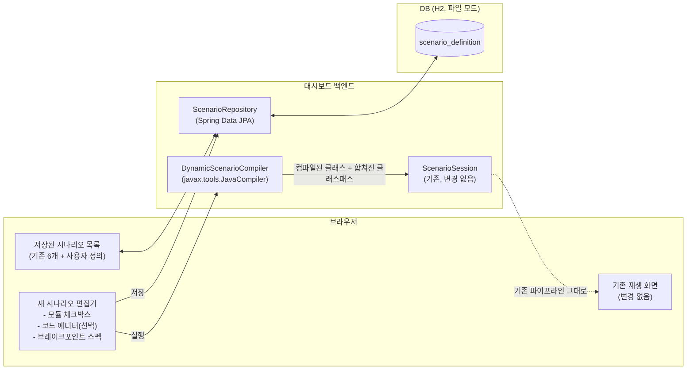

# 학습 대시보드 확장 — 동적 시나리오 설계

**구현 현황**: 1단계·2단계 모두 구현 완료. `ScenarioCatalog`는 DB(H2) 기반으로 바뀌었고, 브라우저에서 기존 모듈을 골라 등록하는 것과 즉석 코드를 작성해 서버가 컴파일·실행하는 것 둘 다 라이브로 동작한다 - 실제로 한 번도 컴파일된 적 없는 Lab 클래스를 브라우저에서 작성해 저장하고, 실행 시점에 서버가 컴파일해 실제 JDI 브레이크포인트 히트를 스트리밍하는 것까지 직접 확인했다. 7번 절("향후 고려 아이디어") 다섯 개 모두 구현 완료 - "기존 Lab을 템플릿으로 복제", "소스 코드 안의 인라인 라벨 주석", "실행 히스토리 스냅샷", "시나리오 → 정식 문서 뼈대 export", "A/B 비교 실행"(요청 보내기 UI 포함). A/B 비교는 원래 시나리오 6개의 모든 "자동 재생 × HTTP 트리거" 교차 조합(빈 생명주기/AOP 자동 프록시/트랜잭션 전파/이벤트 멀티캐스트 각각을 DispatcherServlet 흐름·MVC 예외 우선순위와 짝지은 것)까지 직접 돌려, 두 세션이 서로 간섭 없이 독립적으로 진행되고 요청이 지정한 쪽에만 정확히 전달되며 종료 시 자식 JVM이 매번 깨끗이 정리되는 것을 확인했다.

[`03-learning-dashboard-design.md`](03-learning-dashboard-design.md)가 만든 대시보드는 원래 시나리오 6개(빈 생명주기, AOP 자동 프록시, 트랜잭션 전파, DispatcherServlet 흐름, 이벤트 멀티캐스트, MVC 예외 우선순위)를 전부 `ScenarioCatalog`에 **자바 코드로 하드코딩**해 뒀다 - 어느 Gradle 모듈의 어느 `main()` 클래스를, 어느 브레이크포인트 스펙으로, 어느 손으로 짠 해석기로 보여줄지가 전부 소스에 박혀 있었다(조건 평가 리포트 시나리오는 애초에 `ScenarioCatalog`를 타지 않는 별도 구조라 이 목록엔 포함되지 않는다 - 03번 문서 6.5절). 새 시나리오를 하나 추가하려면 새 실험 모듈 + `main()` 진입점 + 스펙 파일 + 해석기 클래스까지 매번 손으로 만들고 커밋해야 했다.

이 문서는 그 마찰을 없애는 두 가지 확장을 설계한다: (1) 이미 있는 실험 모듈을 브라우저에서 즉석으로 골라 새 시나리오로 등록하는 것, (2) 아예 새 코드를 브라우저에서 바로 작성해서 서버가 컴파일·실행하는 것. 둘 다 시나리오 정의 자체를 DB에 저장해서, 다음에 다시 쓰거나 수정할 수 있게 한다.

## 0. `03`번 문서의 Non-goal과의 긴장 관계

`03`번 문서 9번 절은 명시적으로 "강한 인터페이스로 플러그인화를 미리 설계하지 않는다 — 실제로 두세 개 더 늘려 봐야 진짜 필요한 추상화가 보인다"고 못 박아 뒀다. 이 문서는 정확히 그 "플러그인화"를 하겠다는 것이므로, 왜 지금은 타당한지 먼저 밝혀 둔다: 그 원칙이 말한 "두세 개"를 이미 훌쩍 넘어 6개 시나리오를 만들었고, 그 6개 모두 정확히 같은 네 가지 재료(모듈 경로, main 클래스, 브레이크포인트 스펙, 해석기)로 조립된다는 패턴이 반복적으로 확인됐다 — `ScenarioCatalog.register()` 호출 6번이 그 증거다. 지금 일반화하는 것은 조급한 추상화가 아니라, 이미 충분히 검증된 패턴을 뒤늦게 데이터로 옮기는 것이다.

## 1. 결정된 전제

1. **1단계(기존 모듈 동적 선택)와 2단계(즉석 코드 작성)를 한 번에 설계하고 순서대로 구현한다** — 별도 기능으로 쪼개 릴리스하지 않고 하나의 작업 단위로 진행하되, 2단계는 1단계가 만든 인프라(DB 스키마, `ClasspathResolver` 조합 호출) 위에 얹는다.
2. **기존 파이프라인은 그대로 재사용한다** — `ScenarioSession`/`TracerServer`/WebSocket(STOMP)/원본 이벤트 로그 패널은 손대지 않는다. 새로 필요한 건 "어떻게 실행 대상 클래스와 클래스패스가 정해지는가"라는 앞단뿐이다.
3. **로컬 전용 도구라는 전제는 유지하되, 2단계는 그 전제를 훨씬 세게 요구한다** — `03`번 문서는 "임의 프로세스를 띄우는 도구이므로 localhost 밖에 노출하지 않는다"고 이미 밝혀 뒀는데, 지금까지는 그 "임의 프로세스"가 **이 저장소에 이미 커밋된, 리뷰된 코드**였다. 2단계부터는 **방금 브라우저에서 타이핑한, 한 번도 실행해 본 적 없는 코드**가 된다 — 같은 문장("localhost 밖 노출 금지")이지만 실제 위험 수준은 한 단계 올라간다는 것을 설계 차원에서 분명히 해 둔다.
4. **손으로 짠 해석기(`ScenarioInterpreter`)는 새 시나리오에 강제하지 않는다** — 동적 시나리오는 기본적으로 원본 이벤트 로그 패널만으로 동작하고, 해석기는 여전히 "그 시나리오가 충분히 안정되고 반복해서 쓸 가치가 있을 때" 나중에 손으로 추가하는 선택지로 남긴다.

## 2. 전체 아키텍처



- `Editor`에서 "기존 모듈만 골라 실행"(1단계)하면 `Compiler`는 컴파일 단계를 건너뛰고 바로 `Session`으로 넘어간다 — **컴파일 유무가 1단계와 2단계를 가르는 유일한 분기점**이다. 나머지 파이프라인은 완전히 동일하다.
- `Session`이 받는 입력이 지금은 `ScenarioDefinition`(카탈로그의 고정 엔트리)이었다면, 이제는 `Repo`에서 조회했거나 `Compiler`가 방금 만든 것으로 **출처만 넓어질 뿐 구조는 같다**.

## 3. 데이터 모델

```java
@Entity
@Table(name = "scenario_definition")
public class ScenarioDefinitionEntity {
    @Id @GeneratedValue
    Long id;

    String name;                 // 화면에 보일 이름
    String description;          // 선택, 무엇을 관찰하는 시나리오인지

    // 1단계: 기존 모듈 기반 실행에 쓰임
    List<String> gradleModulePaths;  // 예: ["experiments:custom-scope-lab"] - 여러 개면 클래스패스 합집합
    String mainClass;                // FQCN

    // 2단계: 즉석 코드 실행에 쓰임 - null이면 1단계(기존 모듈) 시나리오
    @Lob String sourceCode;
    // sourceCode가 있으면 mainClass는 그 소스 안의 클래스 FQCN(사용자가 package/class 선언)과 일치해야 함

    @Lob String breakpointSpec;  // 자유 텍스트, 기존 spec 파일과 같은 문법("Class#method1,method2" 줄바꿈 여러 개)

    Instant createdAt;
    Instant updatedAt;
}
```

- 기존 6개 시나리오는 애플리케이션 시작 시 `CommandLineRunner`(또는 `data.sql`)로 이 테이블에 시드 데이터로 들어간다 — `ScenarioCatalog`의 `register()` 호출 6번이 그대로 시드 레코드 6행으로 옮겨진다. **기존 6종 해석기는 그대로 자바 클래스로 남고**, `interpreterKind` 컬럼(문자열 enum)으로 시드 레코드에만 연결해 둔다 — 사용자 정의 시나리오는 항상 `interpreterKind = NONE`.
- `gradleModulePaths`가 리스트인 이유: 2단계에서 사용자가 여러 모듈(예: `spring-tx` 관련 + `spring-webmvc` 관련)을 동시에 참조하는 코드를 작성할 수 있어야 하기 때문이다 - `ClasspathResolver.resolve()`를 모듈마다 호출해 결과를 이어붙인다.
- `breakpointSpec`을 파일이 아니라 컬럼으로 바꾸는 것도 이번 참에 함께 한다 — 기존 `tools/jdi-tracer/specs/*.txt` 파일들은 그대로 두고(다른 곳에서도 참조되므로), 카탈로그 시드 데이터를 만들 때 그 파일 내용을 읽어 컬럼에 복사해 넣는다.

## 4. 컴포넌트 설계

### 4.1 `ScenarioRepository` / 카탈로그 REST API

- `ScenarioCatalog`(기존)는 하드코딩된 `Map` 대신 `ScenarioRepository.findAll()`을 감싸는 얇은 어댑터가 된다 - `resolve(name)`의 시그니처는 그대로 유지해 `ScenarioSession` 쪽 코드는 손대지 않는다.
- 새 REST 엔드포인트:
  - `GET /api/scenarios` — 저장된 시나리오 목록(카탈로그 탭에 표시)
  - `GET /api/scenarios/modules` — `settings.gradle.kts`를 파싱해 선택 가능한 모듈 경로 목록 반환(체크박스용)
  - `POST /api/scenarios` — 새 시나리오 저장(1단계: 모듈+클래스만 / 2단계: 소스코드 포함)
  - `PUT /api/scenarios/{id}`, `DELETE /api/scenarios/{id}`

### 4.2 `DynamicScenarioCompiler` (2단계 핵심)

```java
CompileResult compile(String sourceCode, List<String> gradleModulePaths) {
    String classpath = gradleModulePaths.stream()
            .map(classpathResolver::resolve)
            .collect(Collectors.joining(File.pathSeparator));

    Path outDir = Files.createTempDirectory("dynamic-scenario-");
    JavaCompiler compiler = ToolProvider.getSystemJavaCompiler();
    // StandardJavaFileManager + JavaCompiler.getTask(...)로 sourceCode를 outDir에 컴파일
    // 실패 시 DiagnosticCollector에 담긴 에러를 그대로 CompileResult.errors로 반환
}
```

- 컴파일 산출물은 실행마다 새 임시 디렉터리(`Files.createTempDirectory`)에 떨어진다 - 이전 실행과 절대 섞이지 않는다.
- `ScenarioSession`에 넘기는 최종 클래스패스는 `outDir + File.pathSeparator + classpath` - `outDir`이 항상 앞에 와서 사용자 코드가 우선 로딩된다.
- 컴파일 에러는 `ScenarioSession`을 아예 시작하지 않고 편집기 화면에 그대로 표시한다(자식 JVM을 띄우기 전에 걸러내는 것 - 실행 타임아웃/킬 스위치보다 훨씬 싸게 실패를 막는 방법이다).

### 4.3 프론트엔드 — 새 시나리오 편집기

- 기존 `ScenarioTabs`에 "+ 새 시나리오" 탭을 하나 추가 - 누르면 재생 화면 대신 편집기 화면으로 전환.
- 편집기 구성:
  - 이름/설명 입력
  - 모듈 체크박스 목록(`GET /api/scenarios/modules` 결과) - 1단계 전용일 땐 "실행할 클래스" 드롭다운도 함께(서버가 선택된 모듈의 컴파일된 클래스 중 `public static void main` 있는 것만 스캔해 후보 제시 - 4.1의 확장)
  - "직접 코드 작성" 토글 - 켜면 코드 에디터가 나타나고 클래스 드롭다운은 사라진다(사용자가 방금 짤 클래스이므로 스캔 대상이 없다)
  - 코드 에디터: **처음엔 문법 강조 없는 `<textarea>`로 시작** - 지금까지 이 저장소가 반복해 온 "필요해지기 전엔 넓히지 않는다"는 원칙 그대로다. 실제로 여러 번 써 보고 나서야 CodeMirror/Monaco로 넓힐지 판단한다.
  - 브레이크포인트 스펙 입력(자유 텍스트 textarea, 기존 spec 파일과 같은 문법 그대로)
  - "저장" / "저장하고 실행"

## 5. 안전장치

2단계가 켜는 새 위험(임의 코드 컴파일·실행)에 대한 방어선을 명시적으로 나열해 둔다 - 하나라도 빠지면 이 기능은 만들지 않는다:

- **바인딩은 `localhost` 고정** - 지금도 그렇지만, 이 문서 이후로는 "협상 가능한 설정"이 아니라 "코드로 강제하는 제약"으로 격상한다(예: `server.address=127.0.0.1`을 `application.properties`에 하드코딩하고 프로필로도 못 바꾸게).
- **실행 타임아웃 + 강제 종료** - `03`번 문서가 "알려진 난제"로만 남겨 뒀던 것을 이제 필수 구현 항목으로 승격한다. `ScenarioSession`이 자식 프로세스를 띄울 때 타이머를 걸고, 만료 시 `Process#destroyForcibly()`.
- **컴파일 단계에서 먼저 걸러낸다** - 4.2에서 설명한 대로, 컴파일 에러는 프로세스를 띄우기 전에 잡는다.
- **가벼운 정적 경고(차단은 아님)** - 컴파일 성공 후, 소스 텍스트에 `Runtime.exec`, `ProcessBuilder`, `System.exit`, `Files.delete` 같은 명백히 위험한 API 호출 패턴이 보이면 실행 전에 확인 팝업을 띄운다. 완전한 샌드박싱이 아니라 실수(fat-finger) 방지용 - 이 도구의 유일한 사용자가 본인이라는 전제 위에서, "악의적 코드 차단"이 아니라 "무심코 실행 취소"를 돕는 수준으로 범위를 명확히 좁혀 둔다.

## 6. 알려진 난제

- **컴파일러 가용성** - `ToolProvider.getSystemJavaCompiler()`는 JDK로 실행 중일 때만 non-null이다(JRE로 실행하면 null). 이 저장소는 이미 Gradle 툴체인으로 JDK 21을 요구하므로 실무적으로 문제 없지만, 백엔드 기동 시점에 한 번 확인해서 없으면 "동적 코드 실행" 탭 자체를 비활성화하고 이유를 표시한다(1단계 기능은 컴파일러 없이도 그대로 동작해야 한다 - 기능 저하가 아니라 부분 비활성화).
- **여러 모듈의 클래스패스 충돌** - 서로 다른 모듈이 같은 라이브러리의 다른 버전을 가져올 가능성(예: `spring-webmvc` 모듈과 `spring-jdbc` 모듈이 서로 다른 jackson 버전을 transitively 끌고 오는 경우)은 이 저장소가 단일 버전 카탈로그(`libs.versions.toml`)를 쓰고 있어 현재는 실질적으로 발생하지 않는다 - 다만 발생하면 뒤에 이어붙인 클래스패스가 이긴다는 사실만 문서화해 두고, 실제로 문제가 생기면 그때 해결한다(과도한 사전 설계를 피하는 원칙 그대로).
- **긴 소스코드/많은 시나리오의 DB 크기** - `@Lob` 컬럼(소스코드, 브레이크포인트 스펙)이 쌓이면 H2 파일이 커질 수 있다 - 로컬 개인 도구 규모에서는 무시할 수준이라 판단하고, 필요해지면 오래된 미사용 시나리오 정리 기능을 추가한다.

## 7. 향후 고려 아이디어 (지금 범위 아님)

이번 설계와 함께 떠오른 아이디어들이지만, 지금 구현 범위에는 넣지 않는다 - 나중에 실제로 아쉬워질 때 이 목록에서 골라 온다.

- **[구현 완료] 기존 Lab을 템플릿으로 복제** - "새 시나리오 작성" 폼에 "기존 시나리오에서 복제" 드롭다운을 추가했다. 새 API를 만들 필요가 없었다 - `GET /api/scenarios`가 이미 모든 필드(모듈 경로, 클래스, 브레이크포인트 스펙, 있으면 sourceCode까지)를 돌려주므로, 프론트엔드가 그 응답을 그대로 폼 상태에 채워 넣기만 하면 됐다. 원래 설계는 "기존 6개 중에서"로 좁혀 썼지만 실제로는 사용자가 만든 시나리오까지 포함한 전체 목록에서 고를 수 있게 만드는 쪽이 자연스러웠고, 구현도 오히려 더 단순했다(module-only/source-code 두 종류를 구분할 필요 없이 필드를 그대로 복사하면 되므로) - 이름/제목에 "-copy"/"(복제)"를 붙여 원본과 저장 시점에 충돌하지 않게 하고, 나머지는 사용자가 저장 전에 직접 고치게 남겨 뒀다.
- **[구현 완료] 소스 코드 안의 인라인 라벨 주석** - `InlineLabelParser`가 `// @dashboard-label: "..."` 주석 바로 아래(빈 줄/다른 주석/애너테이션은 건너뛰고) 나오는 첫 메서드 선언을 찾아 "메서드 단순 이름 → 라벨" 맵을 만들고, `ScenarioCatalog`가 그 맵이 비어 있지 않으면 손으로 짠 해석기 대신 `InlineLabelInterpreter`를 골라 쓴다 - 라벨이 붙은 메서드에서 히트가 날 때마다 그 라벨을 그대로 `SemanticEvent`의 `type`으로 내보낸다. 완전한 자바 파서가 아니라 정규식 기반 휴리스틱이다(생성자는 못 찾고, 여러 줄 시그니처도 못 잡는다) - 이 도구가 다루는 작고 단순한 즉석 Lab 클래스에는 실무적으로 충분했다. 프론트엔드 변경이 전혀 필요 없었다는 게 예상 밖의 수확이었다 - `SemanticEventLog`가 이미 `type`/`attributes`를 그대로 보여주는 범용 컴포넌트였기 때문에, 라벨이 붙은 이벤트도 기존 6개 시나리오의 손으로 짠 이벤트와 똑같은 방식으로 그냥 나타났다. 라벨을 별도 JSON 필드로 관리하지 않고 코드 자체에 두는 것 - "정보를 어디에 저장하느냐가 그 정보를 다루는 방식을 결정한다"는 이 저장소가 [50번 문서](../50-placeholder-resolution/placeholder-resolution.md)에서 확인한 원칙과 같은 결이다. 브라우저에서 중첩 클래스(`Config.greeting()`)에 붙인 라벨까지 정확히 동작하는 것을 직접 확인했다 - 클래스 범위를 추적하지 않고 메서드 단순 이름만으로 매칭하는 단순화가, 같은 이름의 메서드가 여러 클래스에 없는 한 실무적으로 문제없다는 것도 함께 확인됐다.
- **[구현 완료] 실행 히스토리 스냅샷** - `ScenarioSession`이 새 이벤트(`ScenarioStarted`)를 발행해 "실행이 막 시작됐다"를 알리고, 새 컴포넌트 `ScenarioRunRecorder`가 `lab.dashboard.web.ScenarioWebSocketController`와 나란히(서로 존재를 모른 채) 같은 도메인 이벤트들을 구독해 완료된(정상 종료 또는 타임아웃) 실행 하나를 `scenario_run` 테이블에 JSON 배열로 남긴다. 두 구독자가 같은 `Map.of(...)` 매핑을 두 번 짜지 않도록 `ScenarioMessageMapper`로 그 로직 자체를 추출해 공유했다 - 웹소켓 중계와 DB 기록이 항상 정확히 같은 봉투 모양을 만든다는 걸 코드 구조로 보장한다. 이 덕분에 프론트엔드의 `RunHistoryModal`은 과거 기록을 재생용으로 특별히 다룰 필요가 없다 - `GET /api/scenario-runs/{id}`가 돌려주는 `events`가 실시간 STOMP 스트림과 정확히 같은 `ScenarioMessage[]` 모양이라, 기존 `RawEventLog`/`SemanticEventLog` 컴포넌트에 그대로 넘기기만 하면 된다(새 렌더링 코드가 필요 없었다). 도중에 다른 시나리오로 교체돼 끝까지 못 간 실행은 기록하지 않는다(완료/타임아웃 이벤트를 못 받은 채 새 `ScenarioStarted`가 오면 버퍼를 버림) - 어중간한 기록보다 "완료된 실행만 진짜 기록"이라는 단순한 규칙을 택했다. "라이브 실행"이라는 이 도구의 핵심 철학과도 충돌하지 않는다: 재생은 **과거의 진짜 라이브 실행 기록**이지, 지어낸 데이터가 아니다 - 실제로 브라우저에서 시나리오를 끝까지 재생하고, "실행 기록" 모달을 열어 그 실행(HIT 20, semantic 이벤트 20개, raw log 44개)을 다시 불러오고, 삭제까지 되는 것을 직접 확인했다.
- [구현 완료] **시나리오 → 정식 문서 뼈대 export** - 대시보드에서 만든 즉석 시나리오가 충분히 흥미로우면, "이 시나리오로 `docs/NN-topic/` 뼈대 만들기" 버튼으로 [`docs/plan/00-methodology.md`](00-methodology.md)의 12절 템플릿 골격(관찰된 이벤트 시퀀스를 8번 절 "런타임 관찰" 표 초안으로) 자동 생성. 이 저장소 전체의 "실험 → 문서화" 워크플로우와 가장 잘 맞아떨어지는 아이디어지만, 템플릿 자동 채움의 품질이 낮으면 오히려 손으로 쓰는 것보다 손이 더 갈 위험이 있어 뒤로 미뤘었다.
  - 품질 위험을 정면으로 다루기 위해, 자동 채움 범위를 "이미 있는 사실을 옮기는" 두 절로만 제한했다: 4절(최소 재현 코드 - 소스/모듈 참조 그대로)과 8절(런타임 관찰 - 선택한 실행 기록의 semantic 이벤트를 표로). 해석이 필요한 나머지 절(2·3·9·10·11·12)은 절대 그럴듯한 문장을 지어내지 않고 `<!-- TODO: ... -->`로 명시해, "도구가 채운 것"과 "사람이 써야 하는 것"을 한눈에 구분할 수 있게 했다.
  - `ScenarioDocExporter`(신규) - `ScenarioRunEntity.eventsJson`에서 `type=="semantic"`만 걸러 `| # | 이벤트 | 원본 히트 | 속성 |` 표로 직렬화. `ScenarioController#export`(`GET /api/scenarios/export?name=&runId=`) - `runId`를 생략하면 그 시나리오의 가장 최근 완료 실행을 쓴다. 순수 텍스트(`text/markdown`)를 돌려주므로 JSON 파싱 계층을 거치지 않는다.
  - 프론트엔드는 `RunHistoryModal`(실행 히스토리 스냅샷 기능에서 이미 만든 화면)에 "이 실행으로 문서 뼈대 만들기" 버튼만 추가했다 - 별도 페이지/모달을 새로 만들지 않고, 특정 실행을 이미 선택해 둔 맥락을 그대로 재사용한 것. 결과는 `<textarea readOnly>` + "복사"(`navigator.clipboard.writeText`) 버튼으로 보여준다 - 파일 다운로드 대신 클립보드 복사를 택한 이유는 브라우저 다운로드 트리거의 부가 복잡도를 피하기 위함.
  - 실제로 "빈 생명주기 + 순환 참조" 시나리오를 20 hit까지 재생한 뒤 내보내 확인 - 4절에 모듈/클래스 참조, 7절에 실제 브레이크포인트 스펙, 8절에 20개 semantic 이벤트가 실제 beanName/속성과 함께 표로 정확히 채워졌고, 나머지 절은 모두 TODO로 남아 있음을 확인했다.
- [구현 완료] **A/B 비교 실행** - 서로 다른 두 시나리오를 동시에 띄워 나란히 비교. `03`번 문서가 명시적으로 전제한 "동시엔 시나리오 1개만"을 정면으로 깨는 것이라 복잡도가 크다고 판단해 뒤로 미뤄 뒀었다.
  - 범위를 실용적으로 좁혔다: 원안의 "같은 시나리오를 프로퍼티/의존성만 바꿔서" 비교하려면 대상 Lab의 `main()`에 프로퍼티 오버라이드를 주입하는 새 인프라가 필요해 별도 설계 문서감이었다 - 대신 이미 DB에 있는 임의의 두 저장된 시나리오(같은 것을 두 번 골라도 됨)를 동시에 재생하는 것으로 좁혀서, 새 인프라 없이 기존 파이프라인만으로 구현했다. 비교 화면에는 개별 Step/Play 컨트롤이 없다 - "비교 시작"을 누르면 선택한 속도로 바로 재생되고 끝까지 지켜보는 용도다.
  - `ScenarioSession`(백엔드) - 세션 저장소를 `AtomicReference<Running>` 하나에서 `Map<String, Running>`으로 일반화하되, 메인 단일 세션 흐름(`running`)과 비교 세션(`comparisonRunning`)을 **물리적으로 다른 두 맵**으로 완전히 분리했다. 처음엔 이름 하나로 구분되는 맵 하나만 두었는데, 비교 화면에서 고른 시나리오 이름이 메인 화면에서 지금 보고 있는 시나리오 이름과 우연히 겹치면(비교 화면 기본 선택값이 목록 첫 항목이라 실제로 자주 겹친다) `startComparison`이 메인 세션을 조용히 죽이고 자기 걸로 갈아치우는 버그를 브라우저에서 직접 재현했다 - 맵을 분리해 근본적으로 없앴고, `ScenarioSessionTest`에 이 정확한 시나리오를 고정하는 회귀 테스트를 추가했다.
  - `ScenarioRunRecorder`도 같은 이유로 `AtomicReference<Recording>`에서 `Map<String, Recording>`으로 일반화했다 - 안 그러면 두 번째 시나리오의 시작 이벤트가 첫 번째 실행 중이던 기록 버퍼를 조용히 밀어내 실행 기록이 유실됐다.
  - `/app/scenario/comparison/start`(두 이름 + 속도), `/app/scenario/comparison/stop`(이름 하나) STOMP 엔드포인트 추가. `ComparisonModal`(프론트엔드)은 `RunHistoryModal`/`ConditionReportPanel`과 같은 "완전히 자기 완결적" 패턴 - 메인 화면과는 별개의 STOMP 연결을 새로 열어, 두 시나리오 이름으로 들어오는 메시지를 직접 갈라 두 컬럼(`SemanticEventLog`/`RawEventLog` 그대로 재사용)에 렌더링한다. 모달을 닫거나 "비교 종료"를 누르면 떠 있는 자식 JVM 두 개를 반드시 정리한다.
  - **알려진 제약**: 비교의 한쪽으로 고른 시나리오 이름이 메인 화면에서 지금 보고 있는 시나리오 이름과 같으면(자기 자신과 비교하면서 동시에 메인 탭도 그것을 보고 있는 경우), 웹소켓 이벤트 봉투가 "어느 세션에서 왔는지"가 아니라 시나리오 이름만 담기 때문에 메인 화면의 로그에 두 프로세스의 이벤트가 섞여 보인다. 세션이 서로를 죽이거나 실행 기록이 깨지는 실질적인 문제는 아니고(둘 다 분리된 맵/기록으로 각자 온전히 진행된다), 흔치 않은 자기 자신과의 우연한 이름 중복이라 막지 않고 알려진 제약으로 남겨 둔다 - 직접 재현해서 확인.
  - 실제로 "빈 생명주기 + 순환 참조" vs "AOP 자동 프록시 생성"을 동시에 재생해, 두 프로세스가 서로 다른 속도로 독립적으로 진행되고(HIT 20/HIT 38로 각자 종료) 실행 기록도 각각 정확히 남는 것을 확인했다. 이후 메인 화면을 별개 시나리오("트랜잭션 전파")로 바꿔 둔 채 같은 비교를 다시 돌려, 메인 화면 HIT 카운트가 전혀 변하지 않는 것도 확인했다("비교 종료"/모달 닫기 시 자식 JVM 정리도 `ps aux`로 함께 확인). 나머지 네 시나리오("트랜잭션 전파" vs "애플리케이션 이벤트 멀티캐스트", "MVC 예외 처리 우선순위" vs "DispatcherServlet 요청 흐름")도 같은 방식으로 돌려 6개 시나리오 전부를 A/B 비교에서 검증했다 - 뒤 조합은 둘 다 HTTP 요청으로 진행되는 시나리오라 애초엔 요청 보내기 UI가 없어 HIT 0에서 멈췄었다.
  - `dispatcher-flow`/`mvc-exception-priority`는 사용자가 직접 HTTP 요청을 보내야 진행되는데, 처음엔 비교 화면에 그 "요청 보내기" 버튼이 없어 HIT 0에서 멈춰 있는 게 정상이었다 - 이어서 추가했다. `ScenarioSession#sendHttpRequest`(메인 흐름 전용, "지금 떠 있는 그 하나"를 암묵적으로 대상)를 그대로 재사용할 수 없었던 이유는 비교 화면엔 세션이 둘이라 "그 하나"가 모호하기 때문 - `sendComparisonHttpRequest(name, ...)`를 새로 추가해 `comparisonRunning`에서 이름으로 정확히 찾는다(공통 전송 로직은 `sendHttpRequestTo(Running, ...)`로 뽑아 공유). `/app/scenario/comparison/http-request` STOMP 엔드포인트, `ComparisonModal`은 `ScenarioVisualization`이 쓰는 것과 같은 `RequestPresets`/프리셋 목록(`DISPATCHER_FLOW_PRESETS`/`MVC_EXCEPTION_PRESETS`)을 그대로 재사용해 각 파인이 자기 시나리오에 맞는 버튼만 보여준다. 실제로 두 시나리오를 비교로 띄운 뒤 A/B 각각에 다른 프리셋을 눌러, 요청이 각자의 세션에만 정확히 전달되고(다른 쪽 HIT/semantic 이벤트는 그대로) 파이프라인이 올바르게 진행되는 것을 확인했다.

## 8. 단계별 구현 계획

```text
1단계: DB 기반 카탈로그 (컴파일 없음)
  - ScenarioDefinitionEntity + ScenarioRepository(Spring Data JPA) + H2 파일 DB
  - build.gradle.kts에 spring-boot-starter-data-jpa, h2(runtime) 추가
  - 기존 6개 시나리오를 시드 데이터로 이관(spec 파일 내용을 컬럼으로 복사)
  - ScenarioCatalog를 Repository 기반 어댑터로 교체 - ScenarioSession 등 하위는 무변경
  - REST: GET /api/scenarios, GET /api/scenarios/modules, POST/PUT/DELETE /api/scenarios
  - 프론트: "+ 새 시나리오" 탭, 모듈 체크박스 + 클래스 선택 폼(코드 에디터 없이)
  - 검증: 기존 6개 시나리오가 DB를 거쳐도 그대로 동작하는지 회귀 확인,
    새 모듈(예: experiments:custom-scope-lab)을 UI에서 등록해 실제로 실행되는지 확인

2단계: 즉석 코드 컴파일·실행
  - DynamicScenarioCompiler(javax.tools.JavaCompiler 기반) + 단위 테스트
    (정상 컴파일 / 문법 오류 / 존재하지 않는 클래스 참조 세 케이스)
  - ScenarioDefinitionEntity에 sourceCode 컬럼 추가(마이그레이션)
  - ScenarioSession 진입부에 "컴파일이 필요한 시나리오면 먼저 컴파일" 분기 추가
  - 안전장치: 실행 타임아웃 + 강제 종료, localhost 바인딩 강제, 위험 API 정적 경고
  - 프론트: 코드 에디터 토글, 컴파일 에러 표시, 위험 API 경고 팝업
  - 검증: 무한루프 코드를 실제로 넣어 타임아웃이 실제로 작동하는지,
    컴파일 에러가 자식 JVM을 띄우지 않고 편집기에 바로 표시되는지 확인
```

## 9. 하지 않을 것 (Non-goals)

- **완전한 코드 샌드박싱** - 5번 절의 정적 경고는 실수 방지용일 뿐, 악의적 코드로부터의 보호가 아니다. 이 도구의 유일한 사용자가 본인이라는 전제(로컬 전용, 인증 없음)가 유지되는 한 그 이상의 방어는 과잉 설계다.
- **문법 강조/자동완성이 있는 풀 IDE 경험** - 처음엔 plain textarea로 충분하다. 4.3에서 밝힌 대로, 실제로 여러 번 불편함을 겪고 나서야 CodeMirror/Monaco 도입을 판단한다.
- **다중 사용자/동시 컴파일 요청 처리** - `03`번 문서의 "동시엔 시나리오 1개만" 전제를 그대로 물려받는다. 동시에 여러 컴파일 요청이 오는 상황은 이 도구의 실사용 패턴(학습자 본인이 혼자 순차적으로 씀)에서 발생하지 않는다.
